Hi! You've found a writeup of tryhackme CTF "Crack the hash". I'm gonna guide you through steps required to finish this room. If you stuck by yourself you've found good place to find answers. Enjoy!

**LEVEL 1**

**Question 1: 48bb6e862e54f2a795ffc4e541caed4d**
First step i did, i've created a file called *hash1* where i've placed first hash to crack.

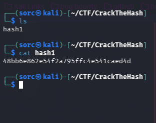

Next i'm gonna identify the hash to know what we're dealing with here by using command *hashcat --identify hash1*.

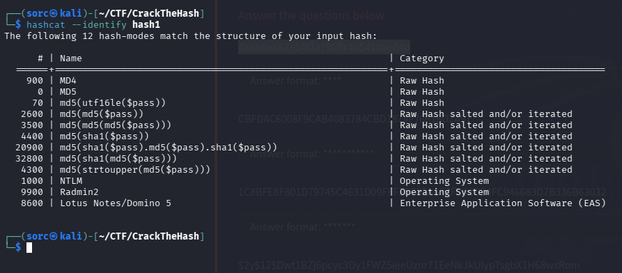

Now, i know almost for sure that this is MD5 hash, because it was my first thought when i saw it.
Let's try to crack it!
I've used rockyou.txt to do this and after few seconds i got an answer.

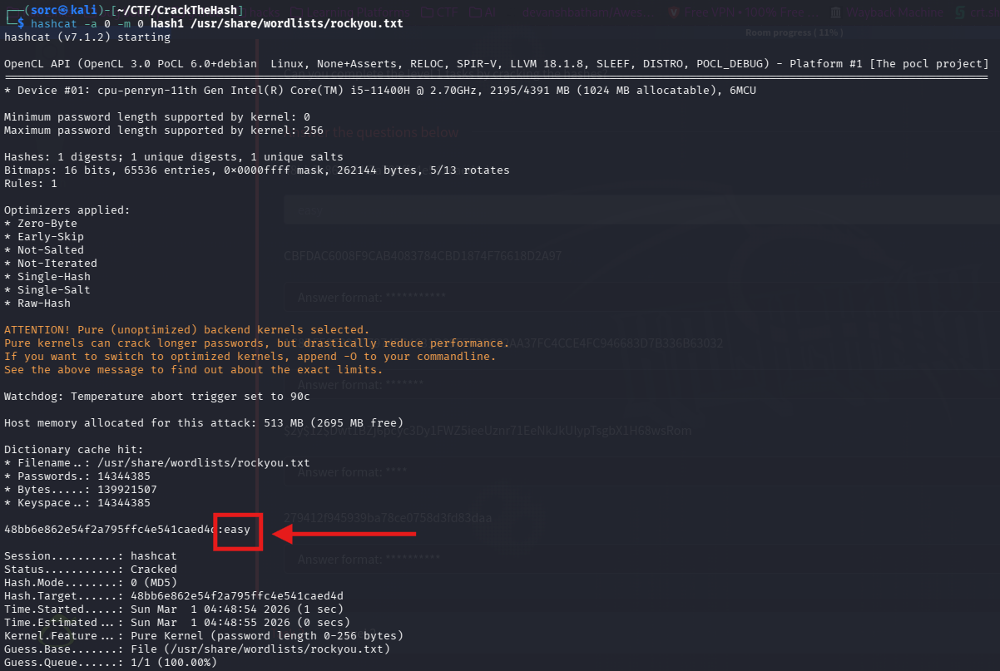

**Answer: easy**

**Question 2: CBFDAC6008F9CAB4083784CBD1874F76618D2A97**
Next one, the same play. Create file with the hash in it. Use *hashcat --identify hash2* command and last part - brute force it.

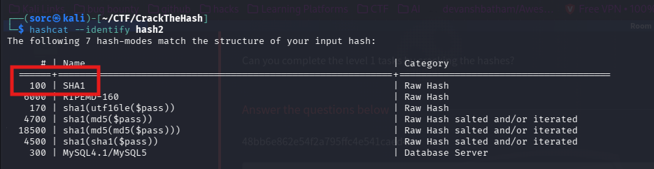

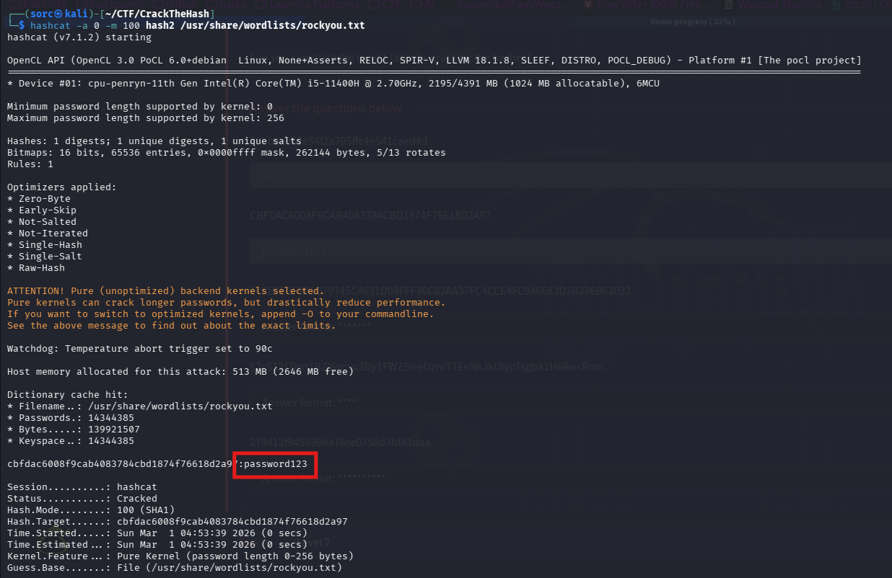

**Answer: password123**

**Question 3: 1C8BFE8F801D79745C4631D09FFF36C82AA37FC4CCE4FC946683D7B336B63032**
This time it's a little tricky. After identifying the hash it's not MD6 from first position, but SHA2-256, the second one.

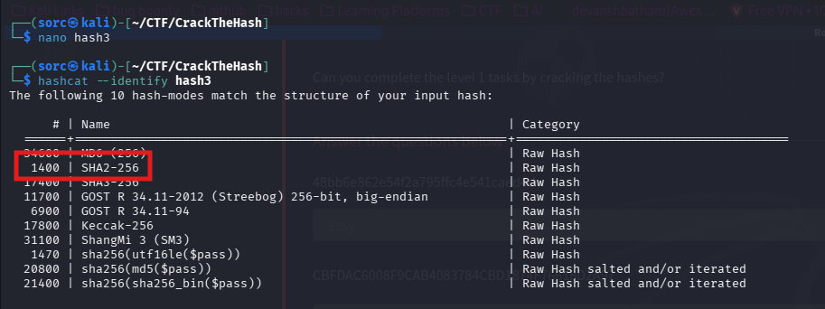

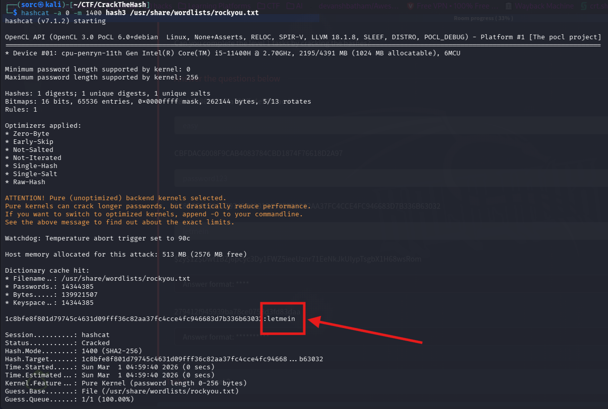

**Answer: letmein**

**Question 4: \$2y$12\$Dwt1BZj6pcyc3Dy1FWZ5ieeUznr71EeNkJkUlypTsgbX1H68wsRom**
Here i wasn't sure about hashcat identifying abilities, so i used a site hashes.com also. After this i was preety sure that this is a bcrypt Blowfish hash.

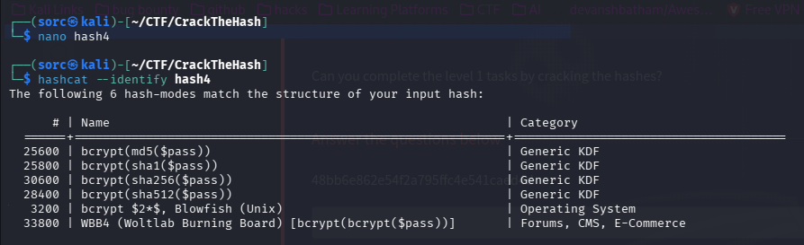

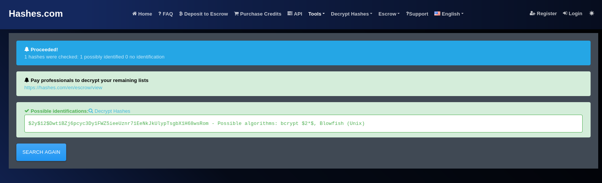

Here i've checked a tip provided on tryhackme and found that this may take a long time doing it traditional way. So i've decided to use *bruteforce* method knowing that the answer has four lowercase characters. So i've used command: *hashcat -a 3 -m 3200 hash4 ?l?l?l?l*.
But it's still took a while to crack and in the mean time i've found better idea. I've used grep to filter all four lowercase characters passwords from rockyou.txt and created another file with it *grep -x '\[a-z]\{4\}' /usr/share/wordlists/rockyou.txt > rockyou_4_lowercase.txt*. Then i used it to crack with command *hashcat -a 0 -m 3200 hash4 rockyou_4_lowercase.txt*. And it was very fast!

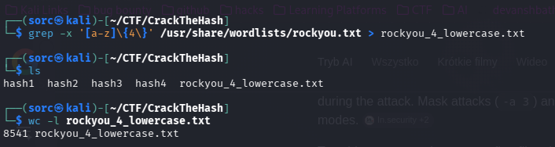

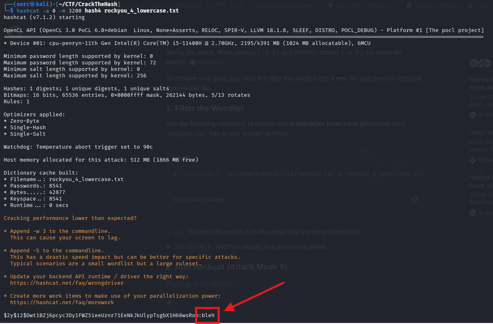

**Answer: bleh**

**Question 5: 279412f945939ba78ce0758d3fd83daa**
This one should be easier than the previous one. First identify then crack!
After identification i went to conclusion that this must be MD4.

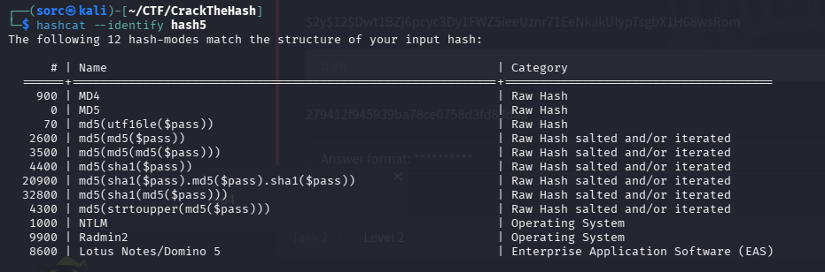

So i started cracking it. But somehow i wasn't able to get the correct answer from hashcat, so i used known site - crackstation.net. And with crackstation help i've cracked it.

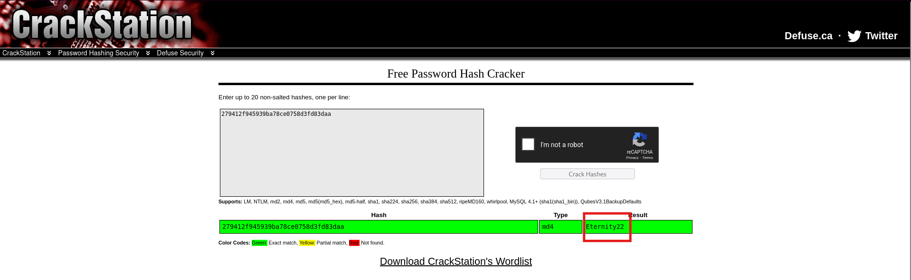

**Answer: Eternity22**

**LEVEL 2**

**Question 1: Hash: F09EDCB1FCEFC6DFB23DC3505A882655FF77375ED8AA2D1C13F640FCCC2D0C85**
After identifying this one with hashcat i wasn't sure which algorithm it is, so i took second opinion from hashes.com.

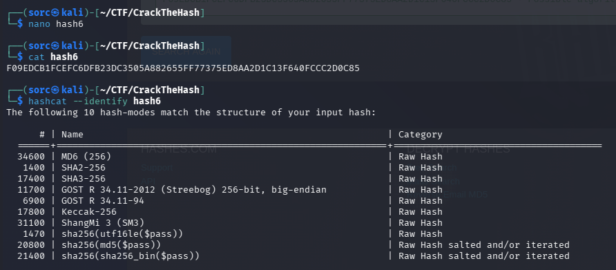

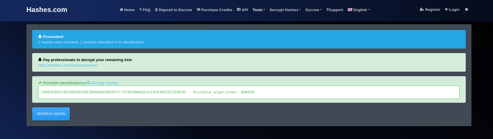

So it must be SHA256. Go back to the terminal. And from there it was fast.

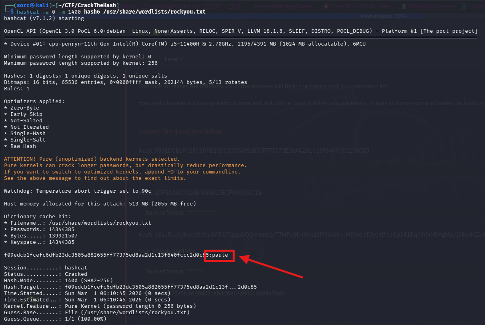
**Answer: paule**

**Question 2: Hash: 1DFECA0C002AE40B8619ECF94819CC1B**
Again hashcat identifying abilities were insufficient so i went back to hashes.com.

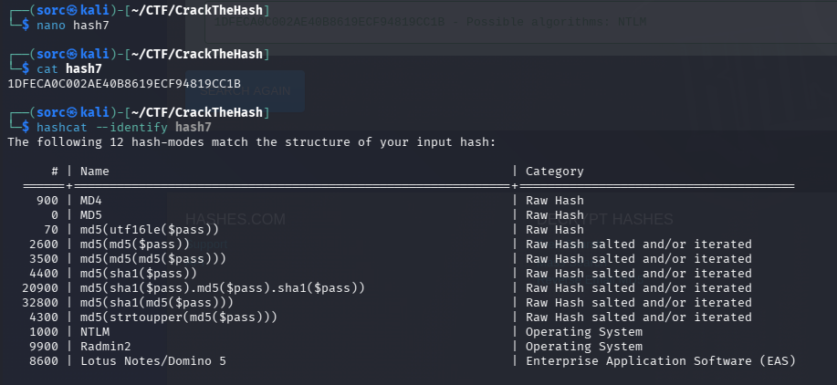

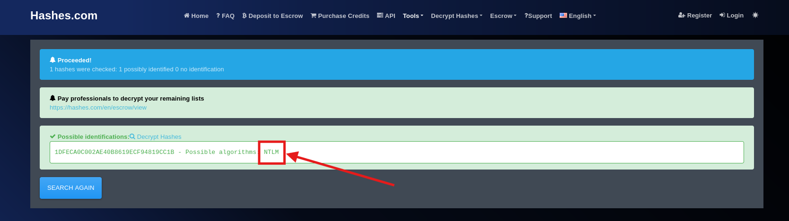

From there i tried cracking the hash knowing it's NTLM.

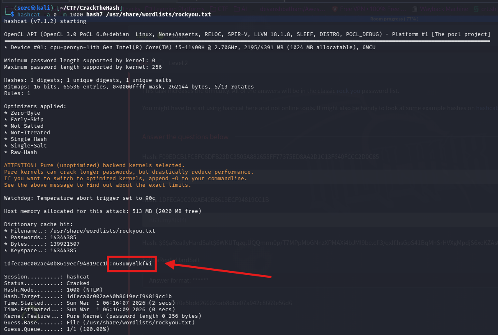

CRACKED!
**Answer: n63umy8lkf4i**

**Question 3: Hash: \$6$aReallyHardSalt$6WKUTqzq.UQQmrm0p/T7MPpMbGNnzXPMAXi4bJMl9be.cfi3/qxIf.hsGpS41BqMhSrHVXgMpdjS6xeKZAs02.
Salt: aReallyHardSalt**
With this one take in mind that you need to leave a dot at the end of this hash. After identification on both hashcat and hashes.com i knew it's sha512crypt.

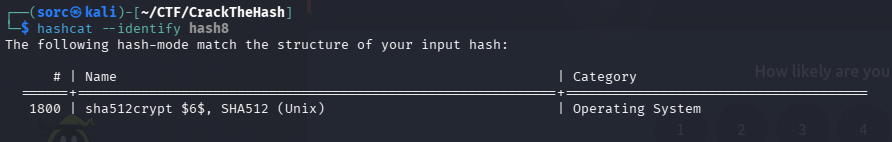

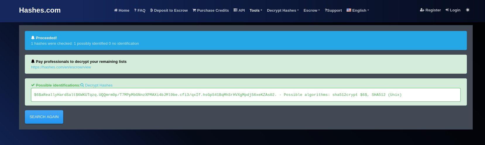

So i went straight forward into cracking it. This one took some time, more than half an hour on my VM Kali, but finally i got it!

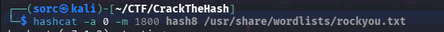

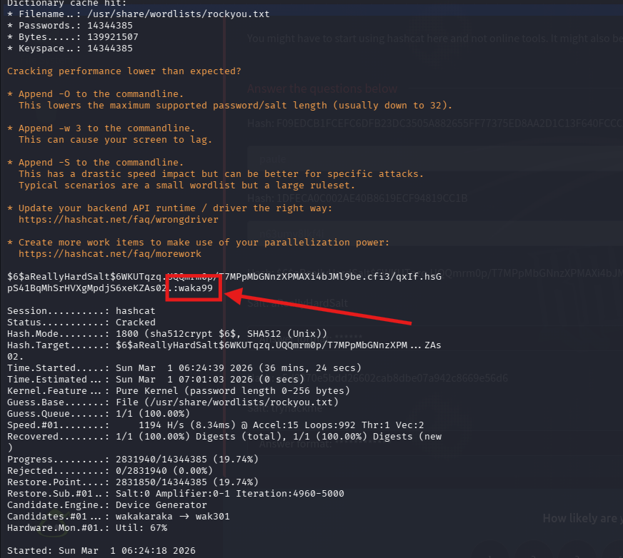]

**Answer: waka99**

**Question 4: Hash: e5d8870e5bdd26602cab8dbe07a942c8669e56d6
Salt: tryhackme**
First step - hash identification.
Note: Remember to add provided salt at the end of the hash file like after semicolon like here:

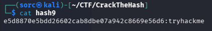

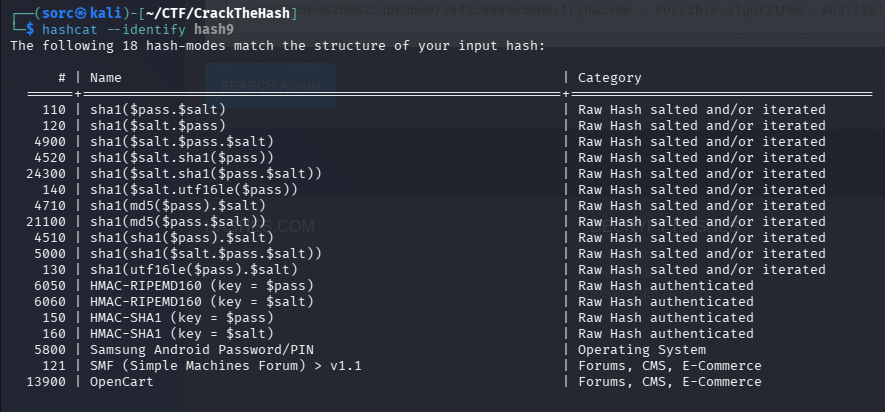

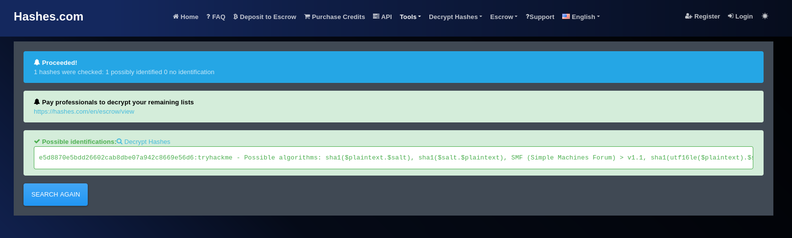

After trying to identify it, i wasn't so sure about the information i get, so i took a tip from tryhackme and it told me that this is HMAC-SHA1 hash. With that in mind i proceeded to cracking.
I used here *-m 160* flag because i had hash and a salt.

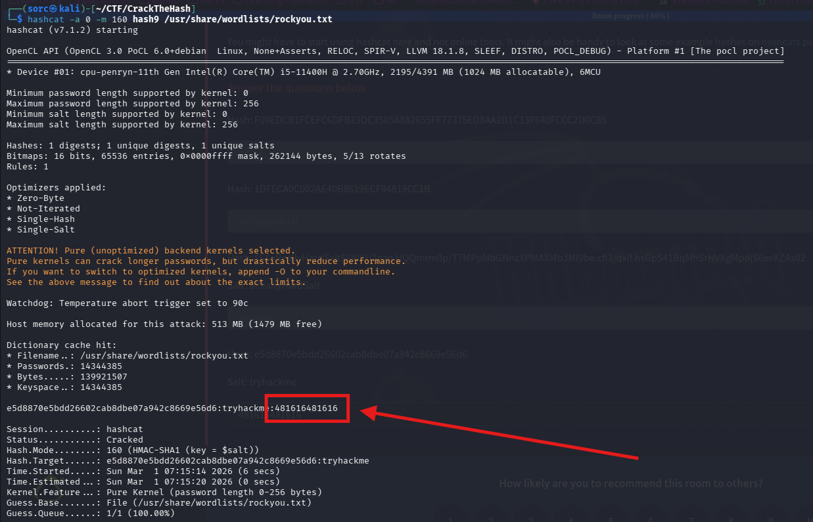

**Answer: 481616481616**

Congratulations!! The room is finished and we've earned a new badge!

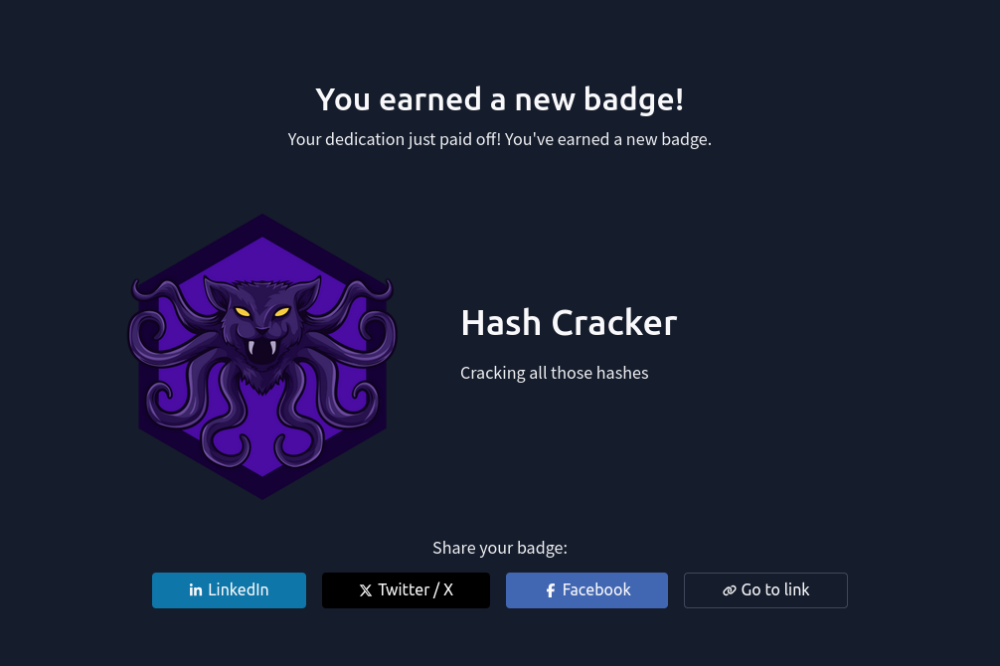

The End.