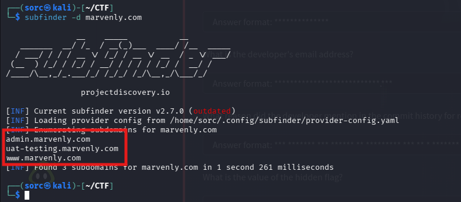
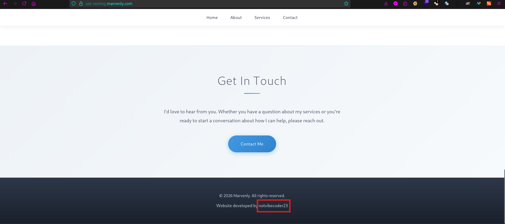
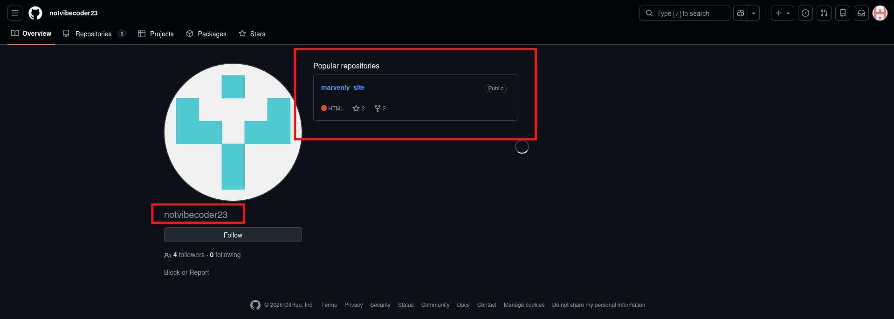
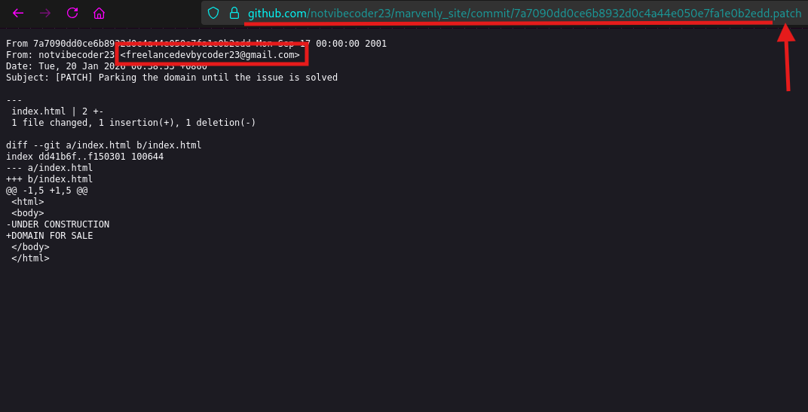
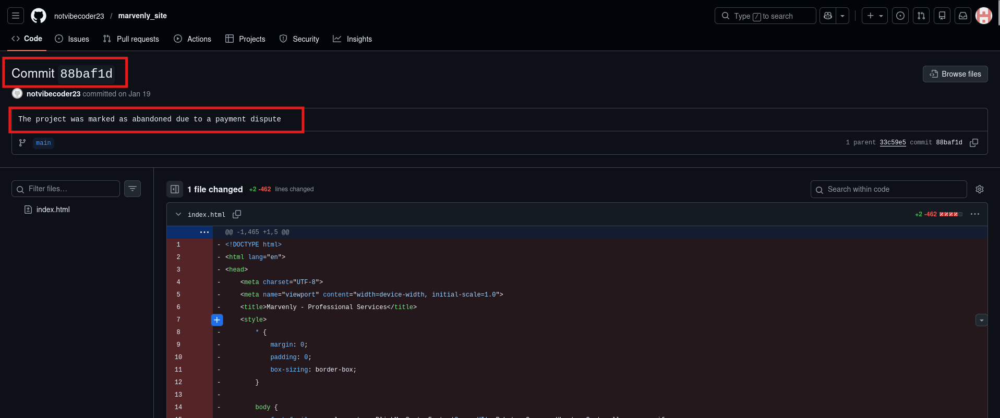
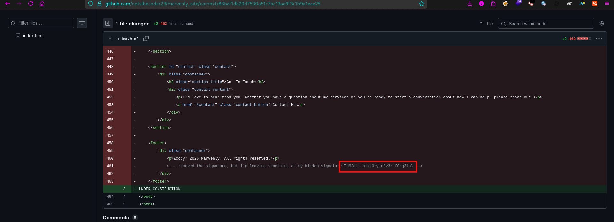

Hi! This is a write up for TryHackMe room called "Dev Diaries".
If you are looking for answer, you will find them here. So, let's jump into it!

Room description:
*We have just launched a website developed by a freelance developer. The source code was not shared with us, and the developer has since disappeared without handing it over.*

*Despite this, traces of the development process and earlier versions of the website may still exist online.*

*You are only given the website's primary domain as a starting point: **marvenly.com***

OK. So, from the description I know that there should be a website *marvenly.com*, but it's currently down. It would be too easy, didn't it? 

Let's jump into the question, because they are good indicators, what to do next.

**Question 1: What is the subdomain where the development version of the website is hosted?**
So, to find subdomains of the website, I would use a tool for that. There are many out there, but first one I thought about was *subfinder* from projectdiscovery, so I've used it. And I've found 3 subdomains for *marvenly.com*

**Answer: uat-testing.marvenly.com**

**Question 2: What is the GitHub username of the developer?**
After answering first question and having a testing subdomain of the website, I've decided to visit it. And it is up and running!
I scrolled down to the bottom of the page and I've found a sign of the developer.

So, I've checked if there is an account on github with the same nick.
And there he was!

**Answer: notvibecoder23**

**Question 3: What is the developer's email address?**
So, I've went back to the website, and I tried to find an email there in the source code and also in the contact form but it was fruitless. Then I've decided to go back to github and checked there, but still no success. So, I've researched how to find github user email address, and I've found an article about it, here is the link: https://www.avonture.be/blog/github-retrieve-email/.
From there I've used method based on last commit, where you need to click on commit id and on the next page you need to add *.patch* to the end of a url. And there I've found an email!

**Answer: freelancedevbycoder23\@gmail.com**

**Question 4: What reason did the developer mention in the commit history for removing the source code?**
I've checked earlier commit with id 88baf1d and there I've found a reason why he did it.

**Answer: The project was marked as abandoned due to a payment dispute**

**Question 5: What is the value of the hidden flag?**
Now, I have the access to the source code of a website that was deleted, so let's take a look, and find the flag. Nearly at the end of it, at line 461, I've found it!

**Answer: THM{g1t_h1st0ry_n3v3r_f0rg3ts}**

That's it for today, thanks for coming by!