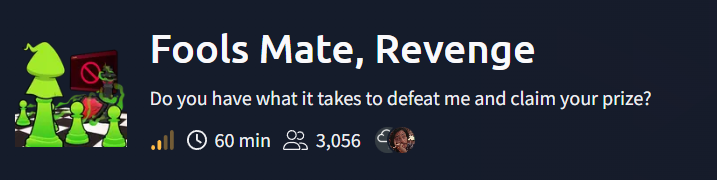
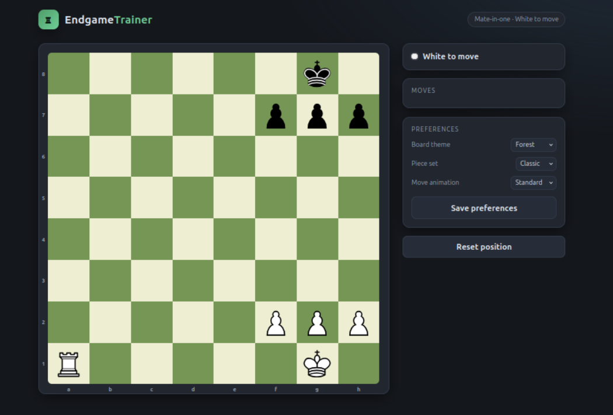
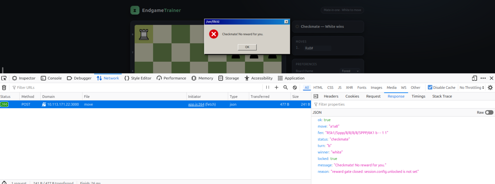
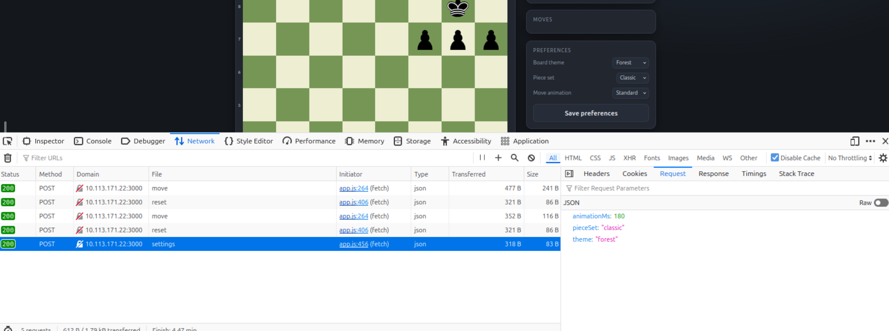
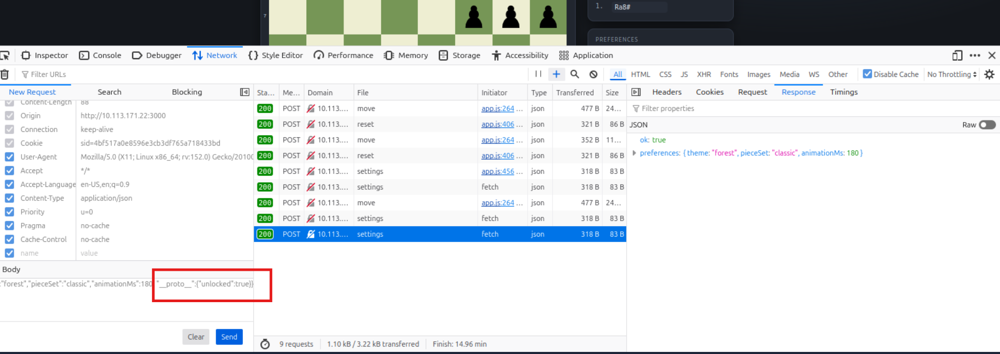
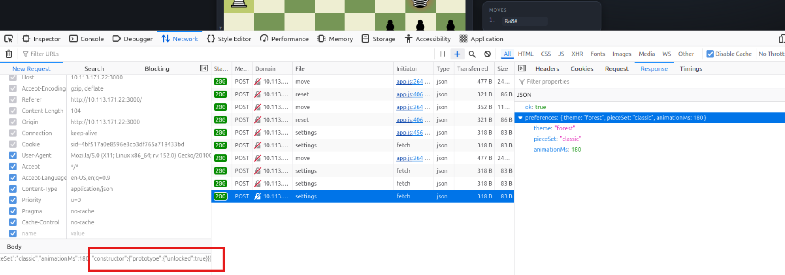
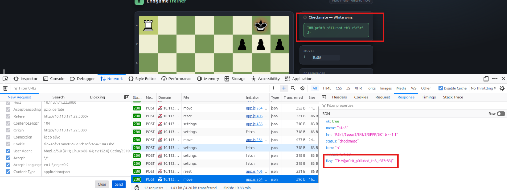

Writeup for a THM CTF Fools Mate Revenge. 

The description says: *I see my client-side defences were no match for you, well done, my apprentice! Let's see if you have what it takes to claim your prize.*

After browsing into the machines page, I was welcomed with the same chess board as before.

But there is something new, *Preferences* feature.
Let's explore the page, and what it does when I try to check mate in one move.

After doing so, the pop up says, that there is no reward for me, and the browser makes a POST request to the `/api/move` endpoint.
There is something interesting in this response, the reason object, which says "reward gate closed: session.config.unlocked is not set".
So, probably I need to unlock the session somehow.

Next I explored the *Preferences* feature, which was absent in the first, *Fools Mate* challenge.

After clicking *Save preferences*, the browser makes POST request to the `/api/settings` endpoint.

First, I checked for Mass 
Assignment vulnerability, which allows to inject new key/values into an object. I tried setting `"unlocked":true`, and other variations but it didn't worked.
So, I decided to test for Prototype Pollution, which allows to inject or modify properties on an object's prototype.
First I tried `"__proto__":{"unlocked":true}` payload, but it didn't worked.

Next I tried playing with `constructor`, and I made a payload: `"constructor":{"prototype":{"unlocked":true}}` which I added to the POST request to the `/api/settings` endpoint.

After sending it, the response didn't show anything extra ordinary, but when I reset position and made a check mate move, the server responded with the FLAG!

