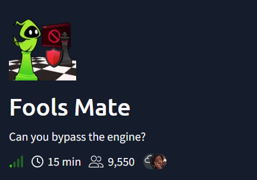
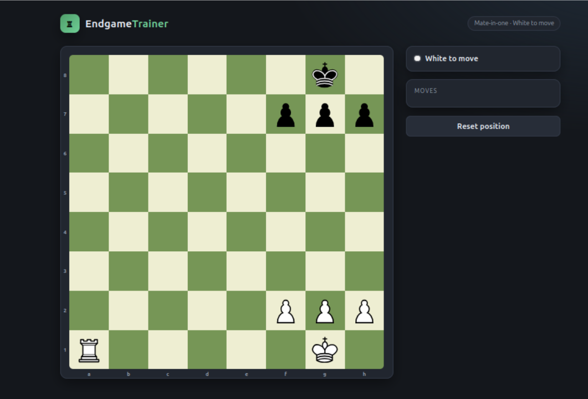
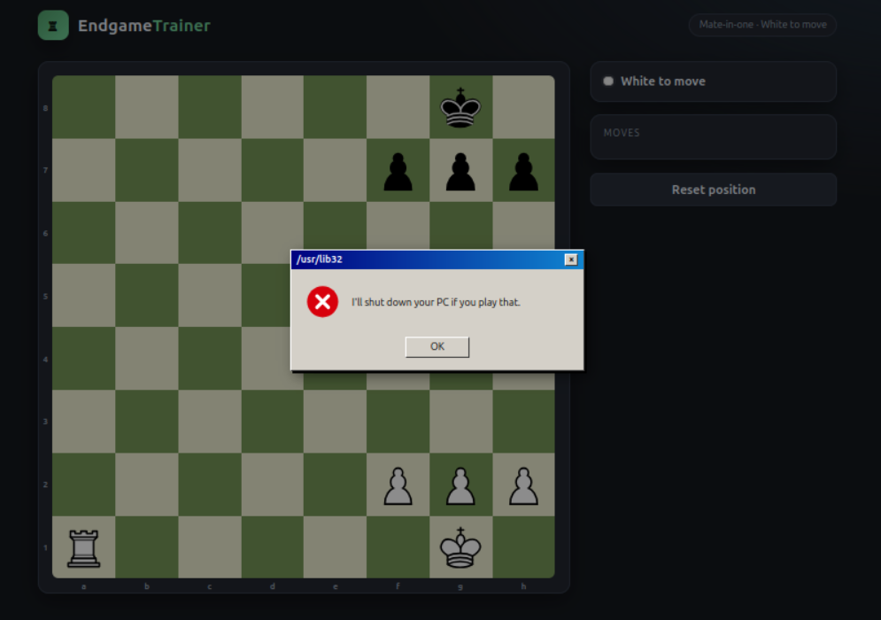
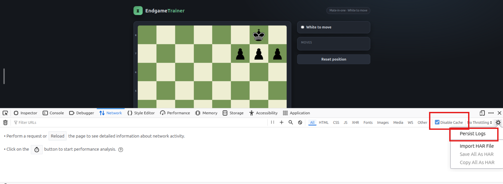
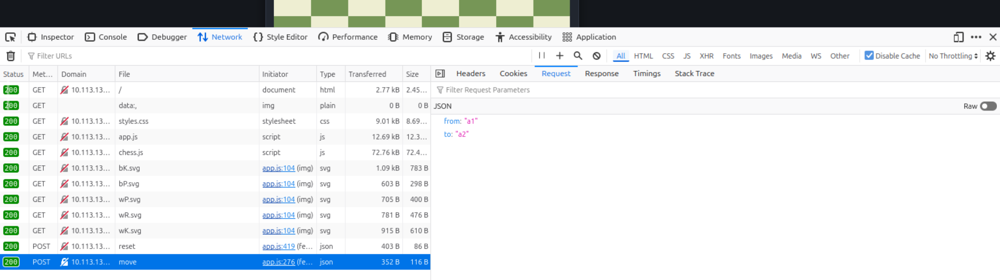
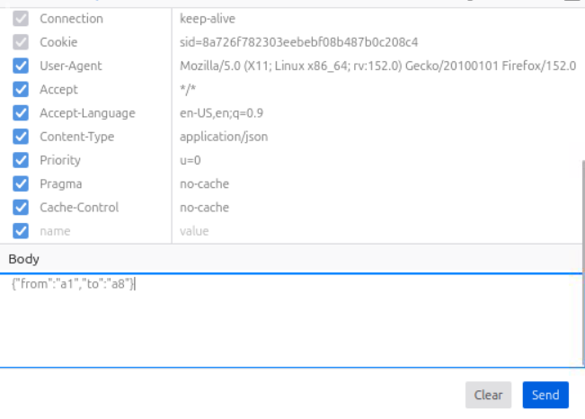
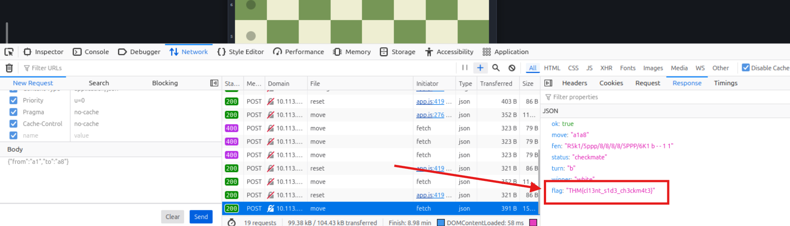

Hi, this is a writeup for Fools Mate THM CTF, where I will provide step by step solution how to solve it. Enjoy!

Description says: *It's mate in one. You know it, the engine knows it, my grandma knows it. The board says checkmate is one click away. The engine says no. Settle the argument.*

So it will be chess challenge. Let's begin!

After browsing to the machine IP i was welcomed with a chessboard.

Obviously, moving a rook to *a8* should be check mate, but the machine wouldn't allow it, and threating me with shutting down my PC...

Now, I need to find a way to bypass it. So, I opened developer tools with F12 key, and went to the Network tab. I clicked *Disable cache* - to force the browser to bypass its local cache, and *Persist logs*, so they don't disappear after refreshing a page.

And I started poking around.
So, when I'm trying to do a check mate, there is no web request made, but when I try to move the rook elsewhere the browser makes POST request to the servers `/api/move` endpoint.

I tried to resend this request but with changed "to" object, so it will make a move to *a8* position and bypass client side pop up with threat of shutting down PC.

Note: Remember to click "Reset position" button on the page, or resend a POST request to `/api/reset` endpoint after making a move. It is important, because you can't make two moves in a row.

After doing it, I got response with a FLAG!

