Welcome in another writeup from thm CTFs! If you're stuck and need some help you found a good place to find the answers!

Room Description:
*The server of this recruitment company appears to have been hacked, and the hacker has defeated all attempts by the admins to fix the machine. They can't shut it down (they'd lose SEO!) so maybe you can help?*

This room has 2 flags to uncover. Let's begin.

The first step is always nmap scan, so let's do it!
I've used command *nmap -A -v -T4 -p- Machine_IP*.

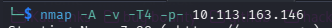

The scan showed me two opened ports: 22 and 80. More important is that we know now it's running Apache so it's Linux machine.
Port 22 is associated with *ssh* so leave it for later. It's never that easy!

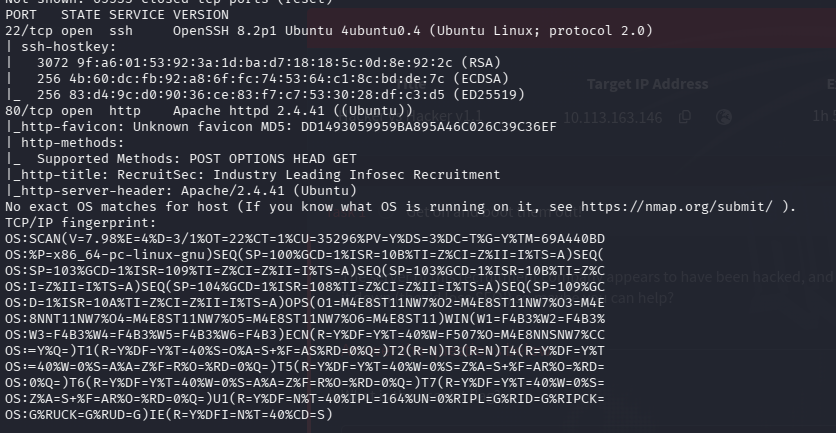

So let's visit webpage now!

Knowing that it is an easy challenge, I'll go with standard dirb active recon without any flags just an URL. And in the meantime I'm gonna click around a little.

At the bottom of the page I've found a file upload section. It may be interesting!

After spotting it I immediately opened Burp Suite. I also inspected it with Web Developer Tools.

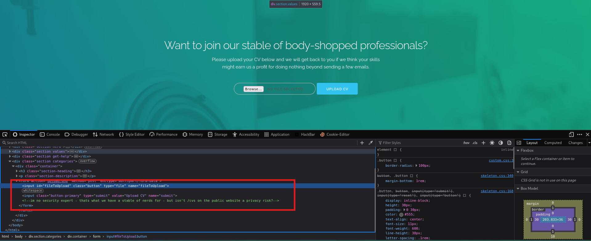

Now I'm sure i need to upload something here.
In the meantime Dirb scan finished but there was nothing interesting. I've checked */csv* directory to find out if there are some files, but i couldn't access it.

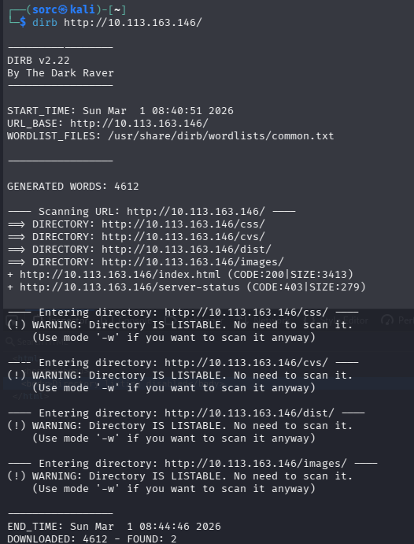

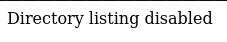

So... I created a *CV1.pdf* file To see what's happen if I upload it. After doing so, I've found a message on site:

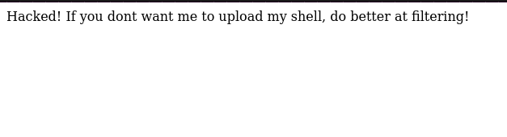

After viewing the source, I have found a commented fragment of code that is filtering uploads.

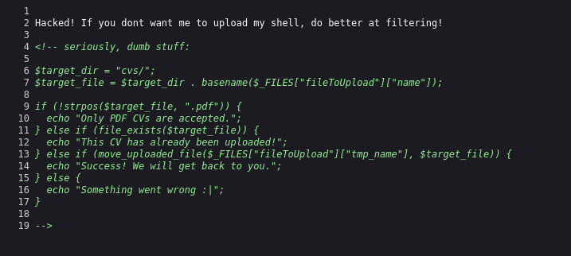

Now I'm going to create a double encoded file with rev shell payload in it.
So, I renamed previously used file *CV1.pdf* to *CV1.pdf.php* and I put php pentest monkey shell generated on revshells.com into it.

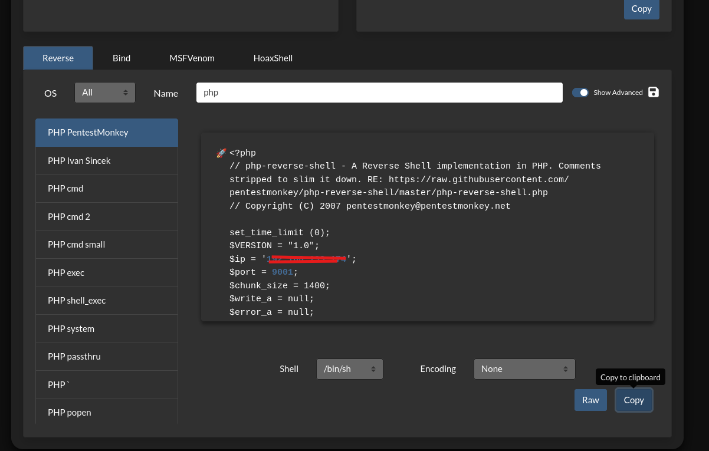

Now it's time to test it. First I used nc listener: *nc -lvnp 9001* to wait for incoming connection. Then I uploaded newly created file with reverse shell in it.
But nothing happened. 
Then I remembered that this is post exploitation scenario, this means that someone already hacked into it, I'm just uncovering steps. This means that the hacker already uploaded shell in it and used it.
So I fuzzed */cvs* directory to find this out.
I used *fuff* to do it and the wordlist was *common.txt* from dirb, as you can see below:

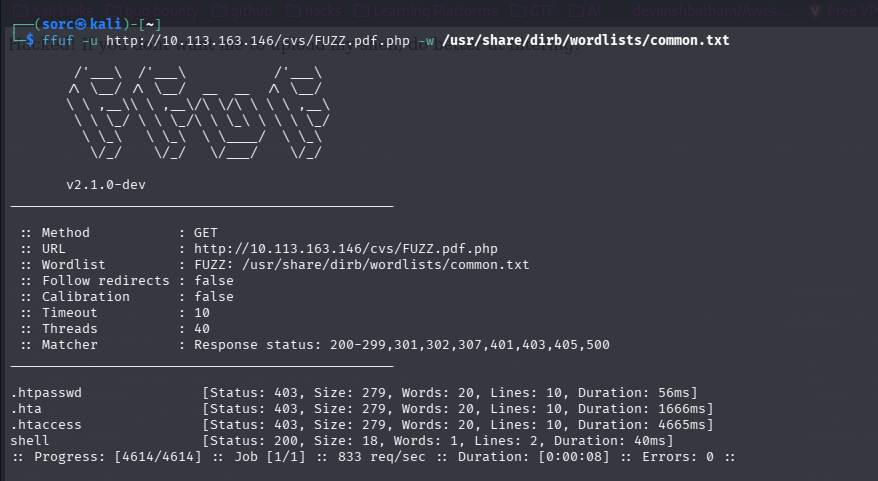

Now i knew that there is a file in */cvs* directory called *shell.pdf.php*. Now i need to fuzz for parameters to run commands.
I used ffuf as well and for this task I found wordlist you can see below.

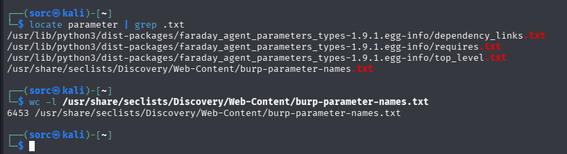

Also when using ffuf i added flag *-fw 1* to filter for matches that had at least 1 character i response.
And with it I've found parameter - *cmd*.

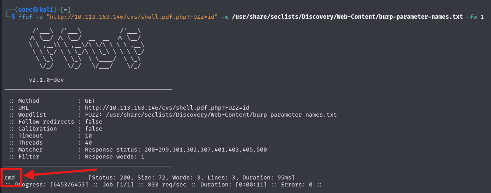

Next step - I'm gonna use this knowledge to gain reverse shell on the target machine.
I searched for address in my browser and intercepted request. I've added it to th repeater in Burp.

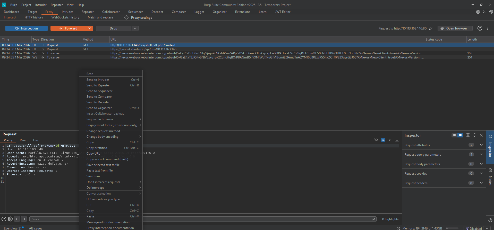

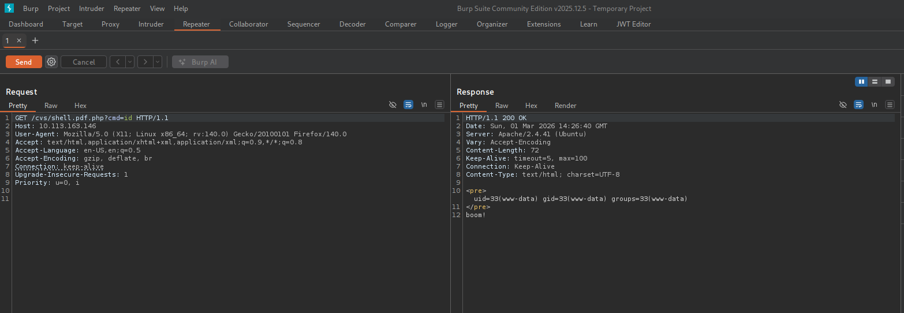

And boom! There is command execution on the server.
Now i need to gain reverse shell. While nc is still in listening mode, I've generated a oneliner to get rev shell on my machine using revshells.com. I used bash -i payload. 

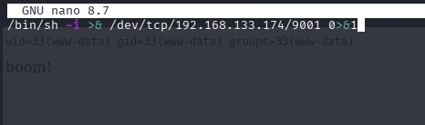

I put it into newly created shell.sh file on my system and used URL encoded payload to download it from my machine into the server and execute it.

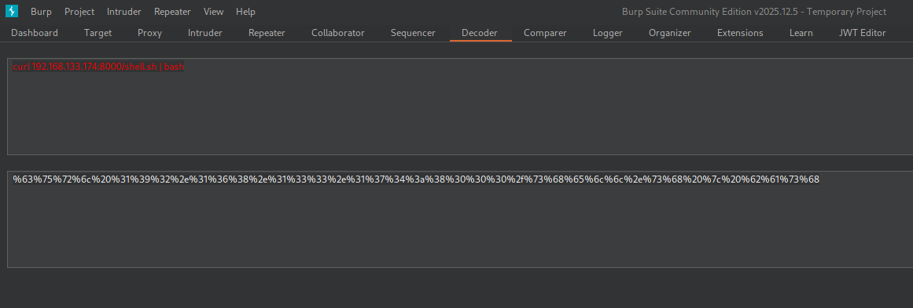

So I set up a simple python server on port 8000 in directory where shell.sh is. 

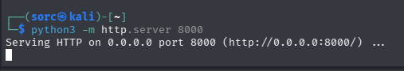

And I've send a payload to download shell.sh with Burp Suite.

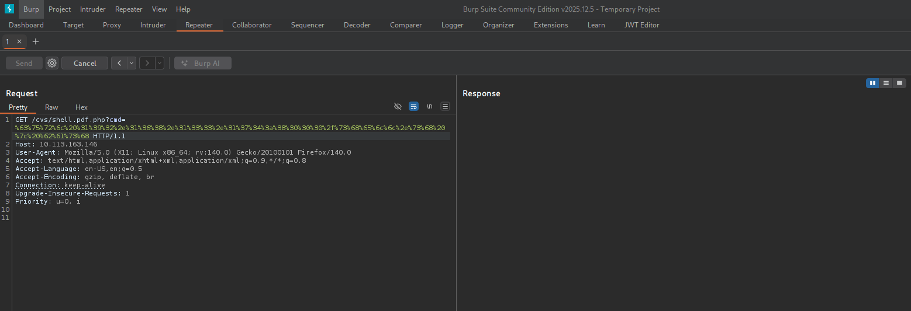

And boom! Here I'm am!

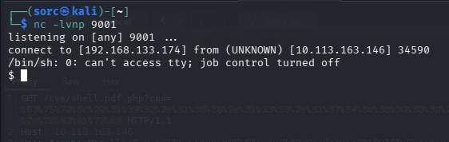

Next I stabilized rev shell with python payload *python3 -c "import pty;pty.spawn('/bin/bash')"*

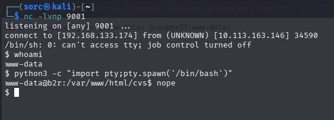

From there I manually enumerated machine, I went into */home* directory and found *lachlan*. I went inside and I've found first flag in the *user.txt* file.

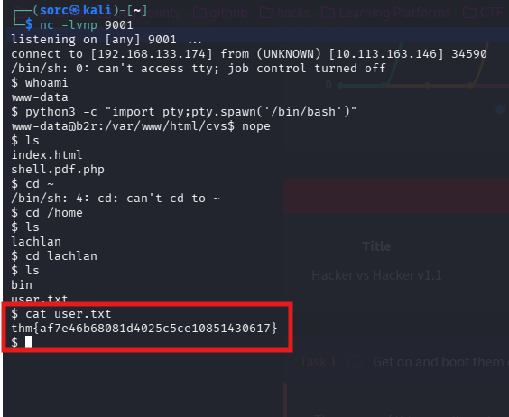

After this it's time for priv escalation.
Being in the *lachlan* directory i checked *.bash_history* file and I've found something interesting:

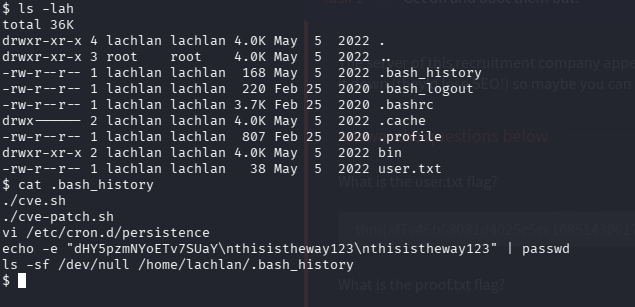

The command *echo* with weird string looking like a password. So i tried to use it when connecting via ssh.
The password indeed was *thisistheway123*. But unfortunately after connecting via ssh to the machine a got disconnected very quickly. There must be a mechanism behind it. So i went back to previous rev shell and looked into */etc/cron.d/persistence*:

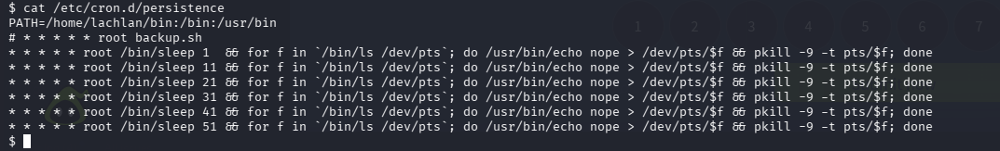

In the PATH I spotted that the */home/lachlan/bin* directory where I as a lachlan have read and write privileges. After googling it, I found out that it not gonna look for directory and it'll go straight into */lachlan/bin* to look for pkill. I'm gonna use it to my advantage and I'm gonna create a file named *pkill* where I'll put reverse shell payload, similar to last one. 
I've changed user to lachlan by *su lachlan* and the password I've found earlier. Then I created a file named *pkill* in */home/lachlan/bin* directory, I changed it to be executable. And I've waited for reverse shell connection on another nc listener i set up minute earlier.

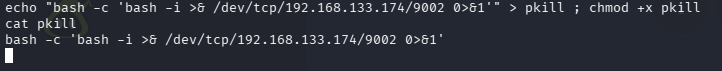

And i got reverse shell as root!

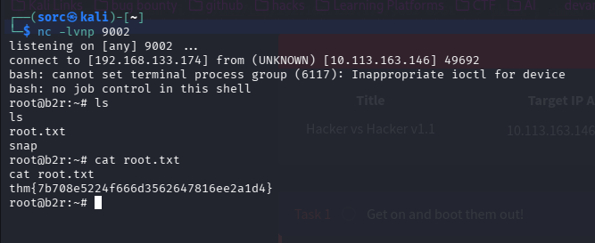

**user flag: thm{af7e46b68081d4025c5ce10851430617}**
**root flag: thm{7b708e5224f666d3562647816ee2a1d4}**

Finished!