Hi! This is a write up for tryhackme challenge named "Investigating with Splunk". I'll provide here a simple solution to finding answers for provided questions. If you're stuck and you don't know what to do, you have found a good place. Enjoy!

Room description:
*SOC Analyst **Johny** has observed some anomalous behaviours in the logs of a few windows machines. It looks like the adversary has access to some of these machines and successfully created some backdoor. His manager has asked him to pull those logs from suspected hosts and ingest them into Splunk for quick investigation. Our task as SOC Analyst is to examine the logs and identify the anomalies.*

First thing to do when navigating to the Splunk instance, click on "Search and Reporting".

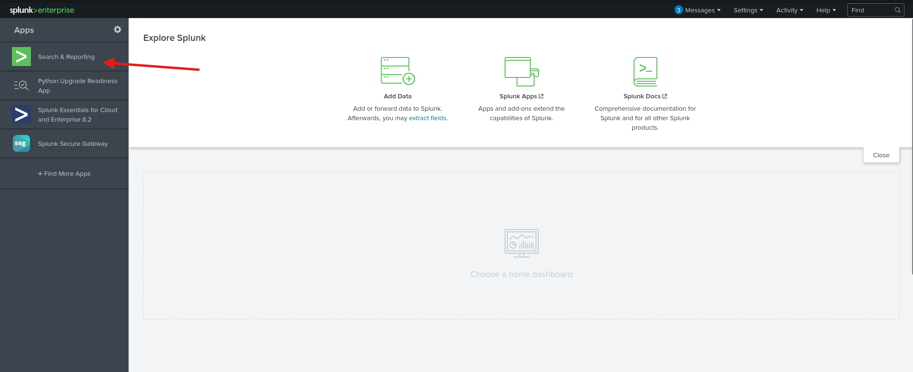

Then change time to all time.

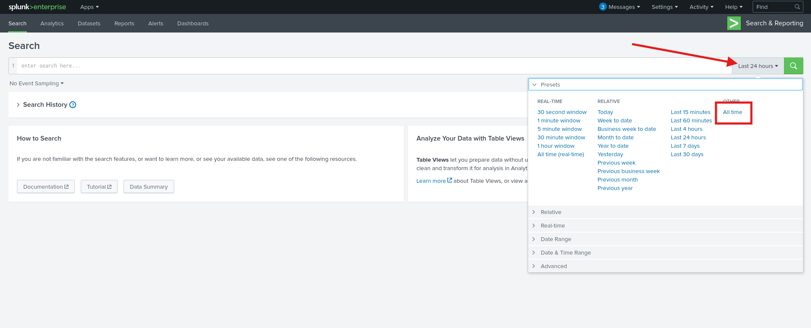

Let's jump into questions.

**Question 1: How many events were collected and Ingested in the index main?**

Type *index=main* into search field.

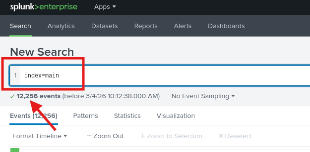

**Answer: 12256**

**Question 2: On one of the infected hosts, the adversary was successful in creating a backdoor user. What is the new username?**
Knowing that adding new user has 4720 Event ID, I've typed it into search bar and Splunk gave me one log entry. 
And there was the answer.

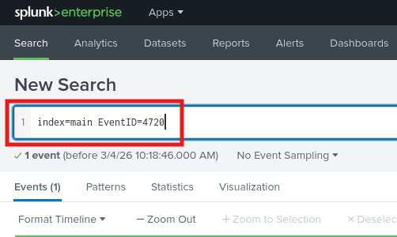

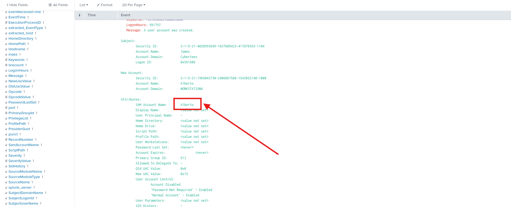

**Answer: A1berto**

**Question 3: On the same host, a registry key was also updated regarding the new backdoor user. What is the full path of that registry key?**
Knowing the hostname now, I've added it to search query and also I've changed Event ID to 13 - which is Event ID in sysmon which corresponds to setting registry value.

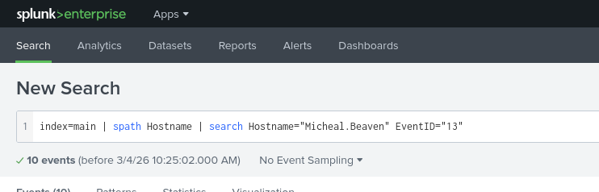

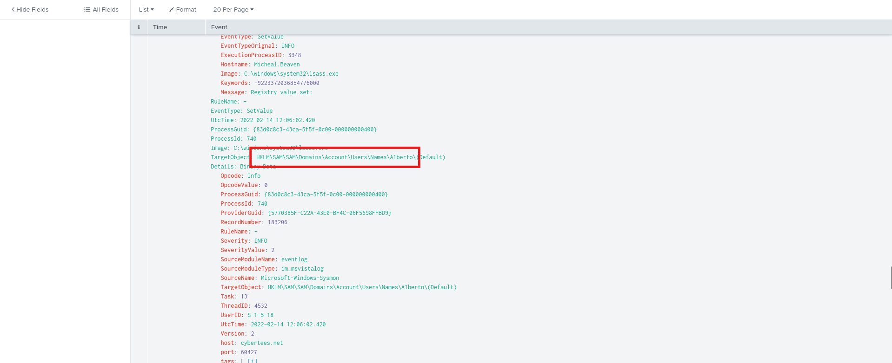

**Answer: HKLM\SAM\SAM\Domains\Account\Users\Names\A1berto**

**Question 4: Examine the logs and identify the user that the adversary was trying to impersonate.**
For the second question I've found a newly created user which was *A1berto* with *1* instead of *l*. That suggest the attacker wanted to impersonate *Alberto*.
**Answer: Alberto**

**Question 5: What is the command used to add a backdoor user from a remote computer?**
To find this out, I simply searched for *A1berto* and I got 14 hits in the logs. I went through them and I've found the answer.

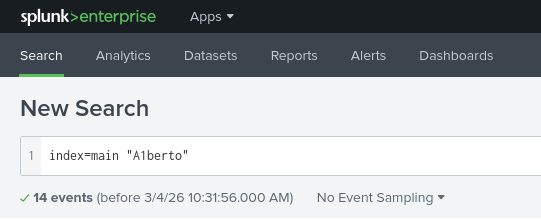

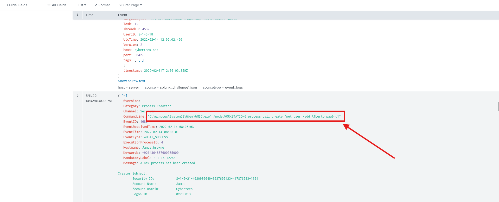

**Answer: C:\windows\System32\Wbem\WMIC.exe" /node:WORKSTATION6 process call create "net user /add A1berto paw0rd1**

**Question 6: How many times was the login attempt from the backdoor user observed during the investigation?**
This is tricky one, I was trying with Event IDs first but without success. Then I simply added to search query hostname where the attacker created user *A1berto* which is *Michael.Beaven* and also username of impostor user.

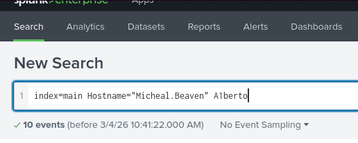

I've checked all 10 events but there was no attempt to login in as *A1berto*. Just bunch of attempt to create an account.
**Answer: 0**

**Question 7: What is the name of the infected host on which suspicious Powershell commands were executed?**

To answer this question, I've added new filed which is *CommandLine* then I've checked what commands were executed and I found suspicious one. I've added it to the query and there I've found hostname.

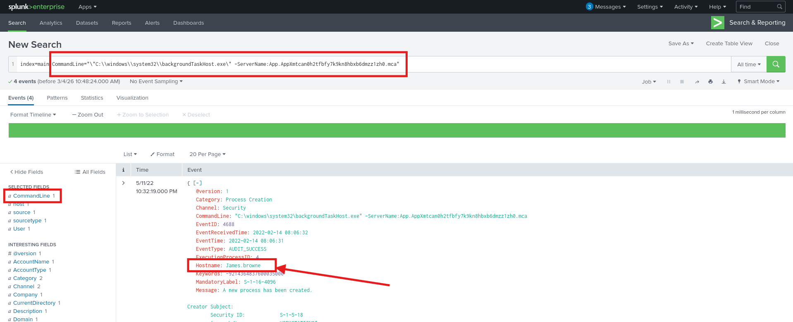

**Answer: James.browne**

**Question 8: PowerShell logging is enabled on this device. How many events were logged for the malicious PowerShell execution?**
Here I've used Event ID 4103 which records pipeline execution details. I also used Event ID 4104 which also handles Powershell logging, but there was no hits on it. And I've found that there were 79 events.

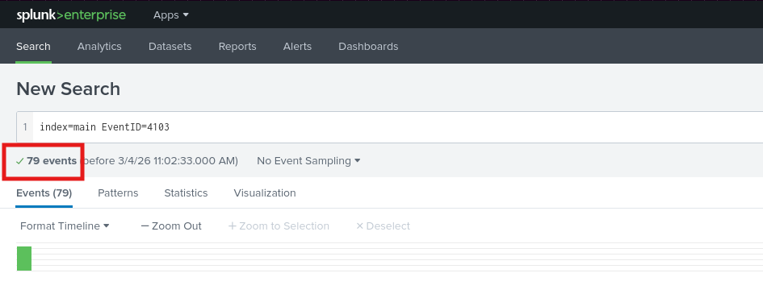

**Answer: 79**

**Question 9: An encoded Powershell script from the infected host initiated a web request. What is the full URL?**
There were one interesting entry in the logs when I've searched the previous query. In it was encoded payload.

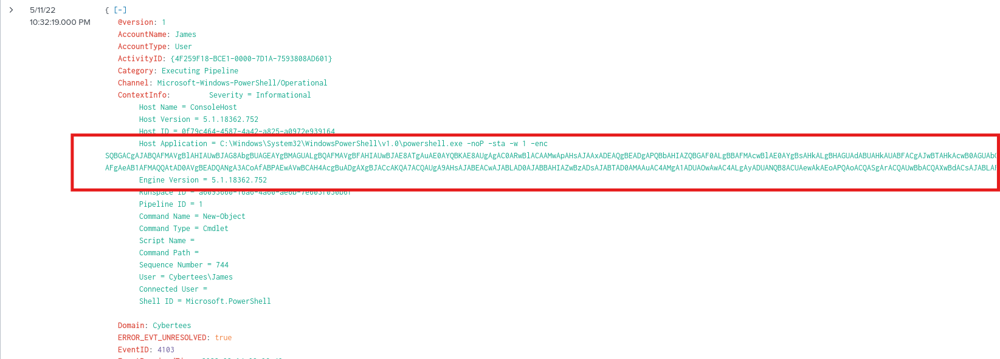

I've put it into CyberChef and decoded.

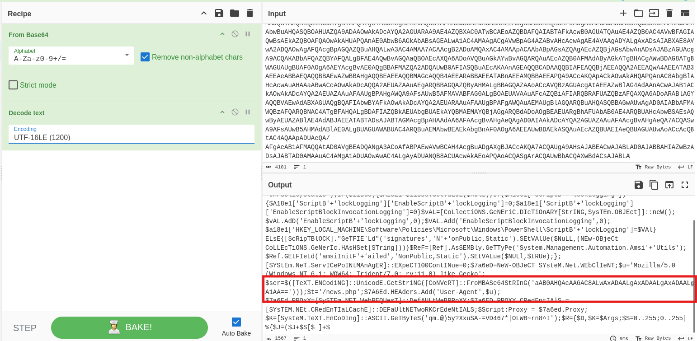

There was another encoded in base64 payload. So I've decoded it too. And it was an IP address. I defanged it and added */news.php* which is part of the URL, you can see it in the image above.

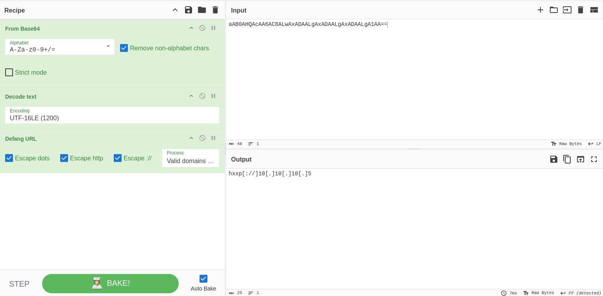

**Answer: hxxp\[://]10\[.]10\[.]10\[.]5/news\[.]php**

The End!