This is writeup for CTF named *IronShade* on TryHackMe.com. If you're doing it right now and you're stuck, you'll find answers you need right here. Enjoy!

**Incident scenario:**
*Based on the threat intel report received, an infamous hacking group, **IronShade**, has been observed targeting Linux servers across the region. Our team had set up a honeypot and exposed weak SSH and ports to get attacked by the APT group and understand their attack patterns.*

*You are provided with one of the compromised Linux servers. Your task as a Security Analyst is to perform a thorough compromise assessment on the Linux server and identify the attack footprints. Some threat reports indicate that one indicator of their attack is creating a backdoor account for persistence.*

In this room we need to investigate the Linux server and identify footprints left behind after the exploitation.

**Question 1: What is the Machine ID of the machine we are investigating?**
To answer first question and grab Machine ID, I need to use command *hostnamectl*. 

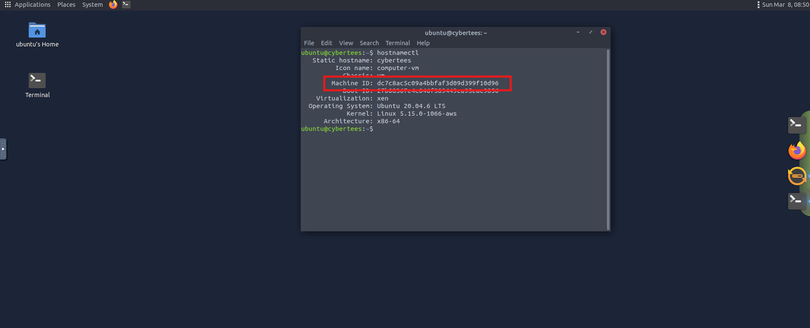

**Answer: dc7c8ac5c09a4bbfaf3d09d399f10d96**

**Question 2: What backdoor user account was created on the server?**
To find out what account was used by threat actors, I've used *osqueryi*. After typing this into the command line, I've typed simple query: *SELECT username, directory from users;*. This query gonna list as you can see above all user accounts and their home directories.

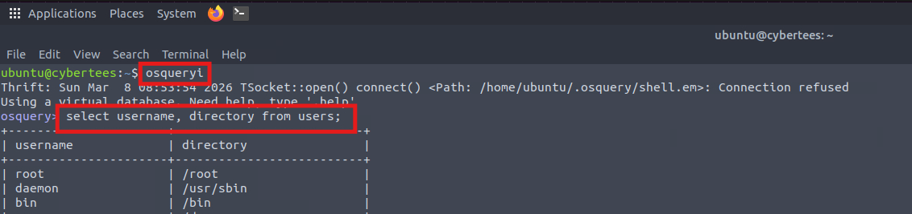

After going through usernames, I've found something weird. There was misspelled account name *mircoservice* and it has his directory in the *home* dir. Weird. I've never seen any misspelled service doing it.

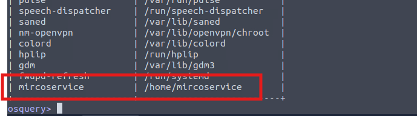

**Answer: mircoservice**

**Question 3: What is the cronjob that was set up by the attacker for persistence?**
First I went into home directory of malicious user to take a quick peak. Then I've used command *sudo crontab -l* to list all cronjobs running on the machine and there it was - cronjob which is running from *microservice* user home directory.

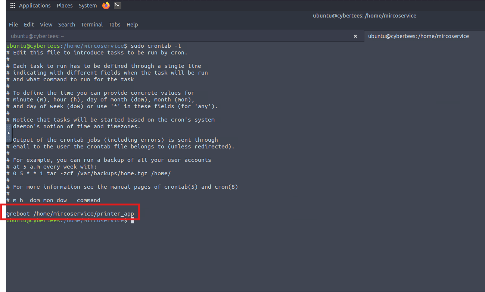

**Answer: @reboot /home/mircoservice/printer_app**

**Question 4: Examine the running processes on the machine. Can you identify the suspicious-looking hidden process from the backdoor account?**
Let's go back to *osqueryi*, to list all running processes. I used query: *SELECT pid, name, path, state FROM processes*.

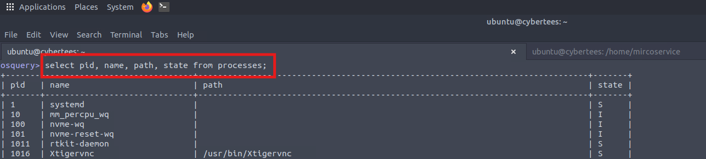

I've started searching for this hidden process. After a second, I've found process with a dot before it's name which indicates that it is hidden.

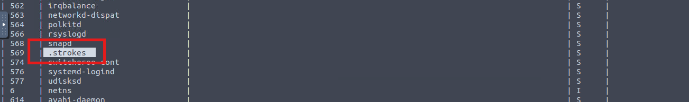

**Answer: .strokes**

**Question 5: How many processes are found to be running from the backdoor account's directory?**
Here osqueryi wasn't giving results so I've tried *ps aux* instead. With grep for */home/mircoservices*.

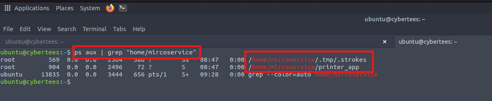

And there are two services running from backdoor account home directory by root.
**Answer: 2**

**Question 6: What is the name of the hidden file in memory from the root directory?**
To do this, I need to get access to root directory. Simply I've typed *sudo su* to change user to root. Then I went to the */root* directory and typed: *ls -lah /*, which listed all files even hidden ones.

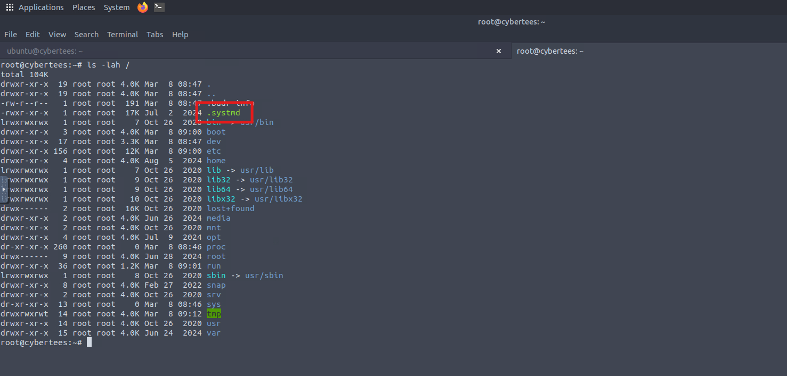

And there was hidden file that I've seen before, answering questions. It was: *systmd*.
**Answer: .systmd**

**Question 7: What suspicious services were installed on the server? Format is service a, service b in alphabetical order.**
I went into */etc/systemd/system* directory, where all services are stored in and used *ls* to list files. At the first glance I've spotted two of them that weren't normal.

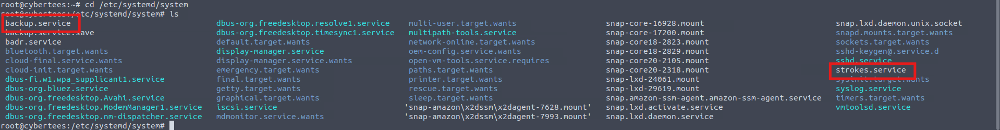

**Answer: backup.service, strokes.service**

**Question 8: Examine logs; when was the backdoor account created on this infected system?**
 I went into */var/log* dir. Listed all available logs in there with *ls*.
 I knew that logs associated with account creation should be in *auth.log*. So, I've used command *cat auth.log | grep -a useradd* and there was one entry matching.

 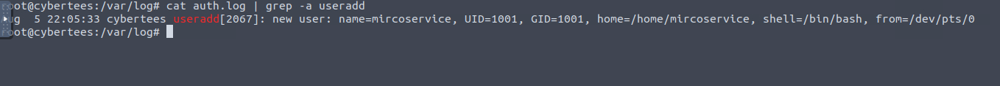

 **Answer: Aug 5 22:05:33**
 
**Question 9: From which IP address were multiple SSH connections observed against suspicious backdoor account?**
I've used similar command as before but this time I was grepping backdoor username - *mircoservice*.
And there was quite a few attempts for login to this user via ssh.

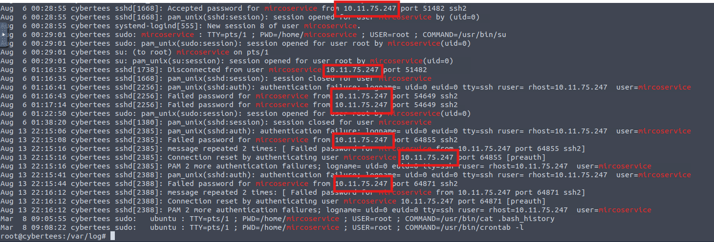

**Answer: 10.11.75.247**

**Question 10: How many failed SSH login attempts were observed on the backdoor account?**
Oh... Now I need to count it. This time I've used command *cat auth.log | grep -a 'Failed password for mircoservice'*, and it gave me what I wanted.

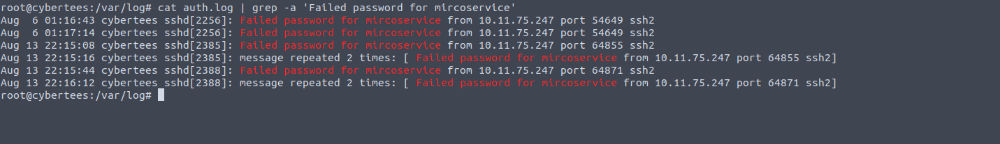

Tip: The lines with a *message repeated 2 times* needs to be count two times.
**Answer: 8**

**Question 11: Which malicious package was installed on the host?**
I've used *dpkg.log* file to list all installed ones with grep - *cat dpkg.log | grep install*. After this I've started to going through all of them. There was one unusual among them.

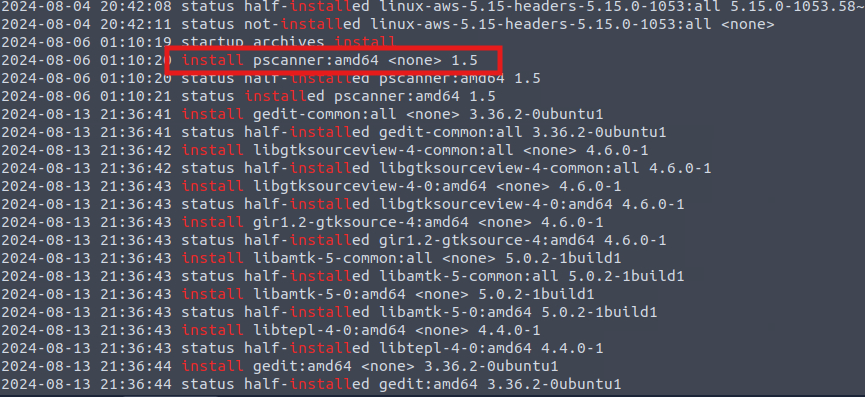

**Answer: pscanner**

**Question 12: What is the secret code found in the metadata of the suspicious package?**
To find this out I've issued a command *apt show pscanner*, to list metadata of the package. And there was the flag!

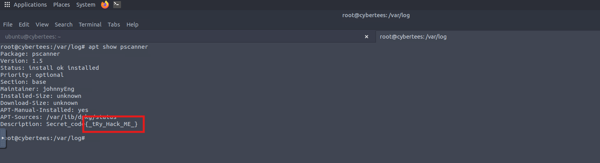

**Answer: {_tRy_Hack_ME_}**

The End.