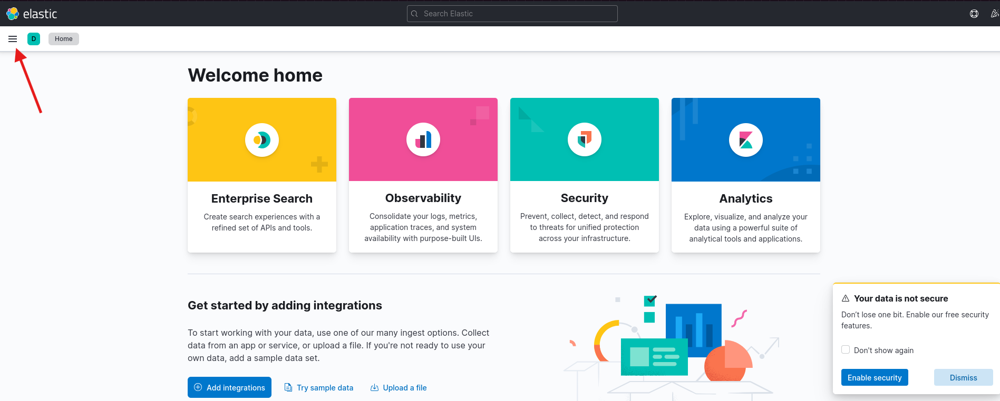
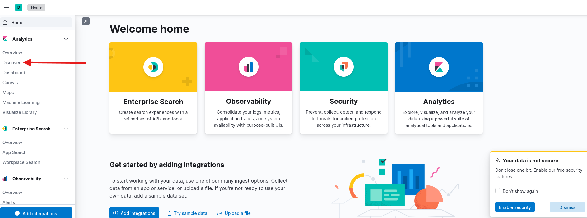
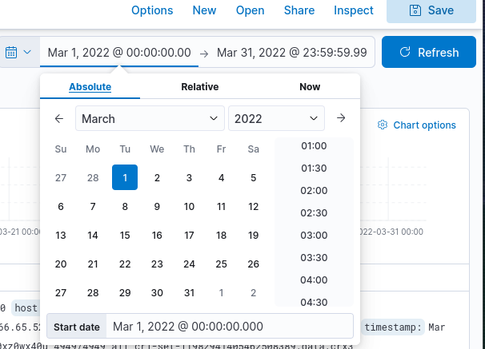
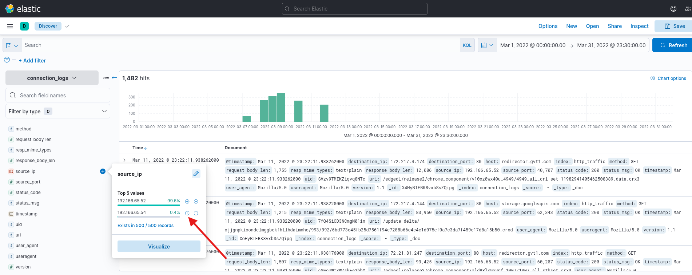
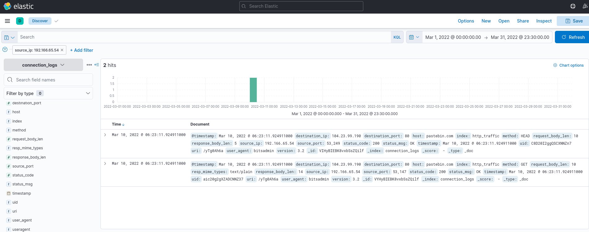
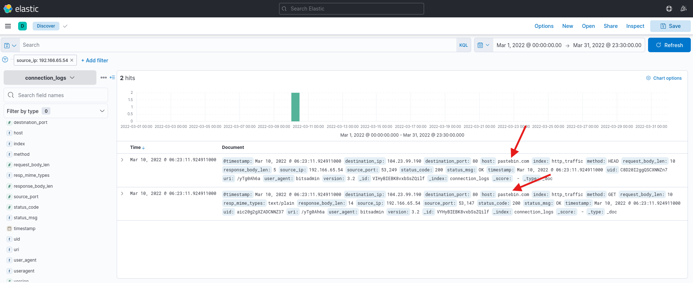
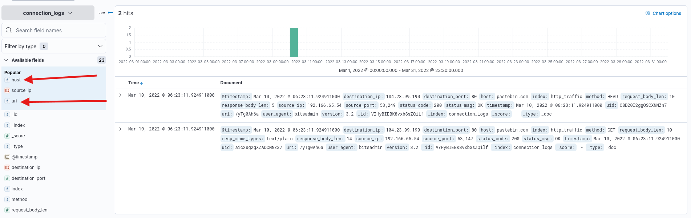
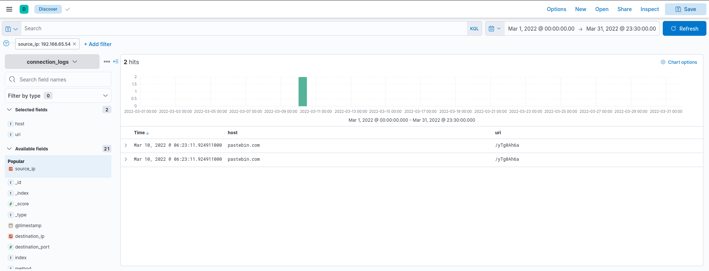
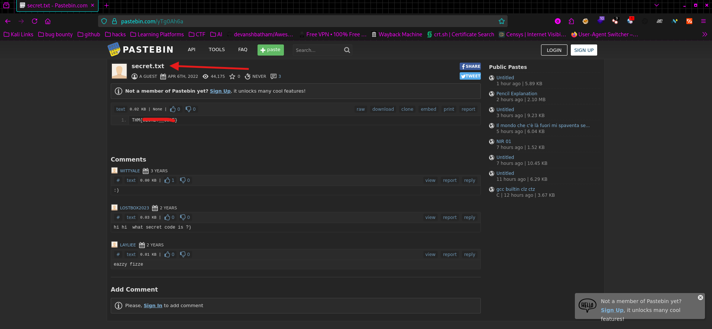

Hi! This is writeup for Blue Team CTF on TryHackMe.com from SOC Level 1 path, called ItsyBitsy. If you are stuck and need any tips or guidance for this room, feel free to look inside. Enjoy!

Hi. This is writeup for room called ItsyBitsy from SOC Level 1 path on TryHackMe.com. We're gonna look into IDS alerts regarding potential C2 communication.

After deploying your machine and navigating to the website we are welcomed with an Elastic "Welcome page". 

From here, click on "Hamburger button". Then you're gonna see a menu. 

Now click "Discover".

Now we need to filter dates. Click a calendar icon and select dates from 1st March 2022 to 31st March 2022 and click update

We'll see all logs from this period of time. Also answer the first question:

**1.How many events were returned for the month of March 2022?**
**Anwer: 1482**

To answer second question, we need to filter traffic. There are two source IP addresses that were communicating at the time of an incident.
Now on the left side of the screen click a source_ip and select 192.166.65.54 by clicking a plus button.

**2.What is the IP associated with the suspected user in the logs?**
**Answer: 192.166.65.54**

**Note**: I've encountered an issue where i hadn't seen an IP address mentioned above. I restarted a machine and it solved it.

Now on our screen you see only 2 log records from IP address 192.166.65.54.

Here we can see in the "user_agent" field a name "bitsadmin". After quick googling it you can learn that it's a built-in Windows command-line tool for creating, managing, and monitoring file transfer jobs using the Background Intelligent.
Now we know that it was a binary used to download malicious file from C2 (command and control) server.

**3.The user's machine used a legit windows binary to download a file from the C2 server. What is the name of the binary?**
**Answer: bitsadmin**

In the logs we can also noticed that a machine was connecting to the host "pastebin.com". 

**4.The infected machine connected with a famous filesharing site in this period, which also acts as a C2 server used by the malware authors to communicate. What is the name of the filesharing site?**
**Answer: pastebin.com**

To answer next question we need to know a full URL to which machine was connecting. To do this we need to filter "host" and "uri" by clicking plus signs in the "Available fields" section on the left site of the site interface.

After doing it we see full path accessed by the infected machine. And we can answer fifth question.

**5.What is the full URL of the C2 to which the infected host is connected?**
**Answer:** pastebin.com/yTg0Ah6a

Now we are gonna visit the website we just found to answer last two of them.
After doing it we can see at the top left the filename accessed by the machine and our FLAG!

**6.A file was accessed on the filesharing site. What is the name of the file accessed?**
**Answer: secret.txt**

**The file contains a secret code with the format THM{________}.**
**Answer: FLAG**

Go and find the flag by yourself!

Thank you for coming by. I hope you found answers you needed to complete this room. 
Have a good day and happy hacking! :)
