Welcome in another THM writeup. In this one I will do CTF called "Missing Person", where i need to use my OSINT skills to help the police track down a missing person. If you're stuck by yourself and looking for answers or tips this is a good place to start. So, let's begin.

Room description:
*"My friend went on holiday in 2025 and shared some photos, but I haven’t heard from him since. Can you help me track him down for the police report?"*

*Download the zip file attached to this task and start your investigation!*

First of all I've created directory for a zip file that I've downloaded and I moved it there.

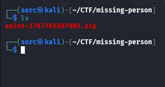

Next, I'll use *unzip* command to check what's inside. After doing so, I've found two jpg files, *MotoGP.jpg* and *food.jpg*.

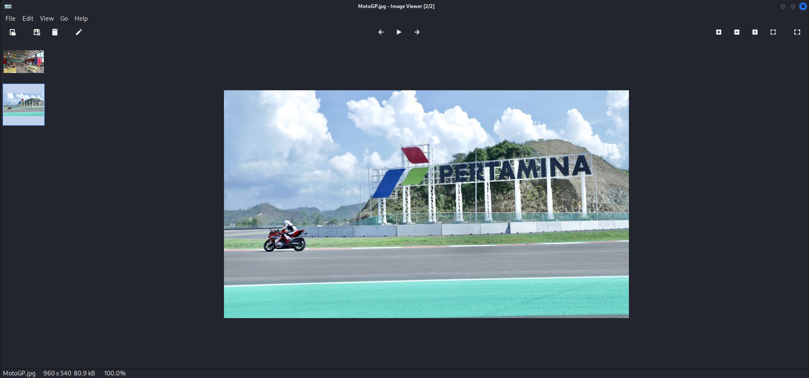

First one is a racetrack and the second some kind of restaurant.

So, knowing that I'll do reverse google search of the *MotoGP.jpg*.

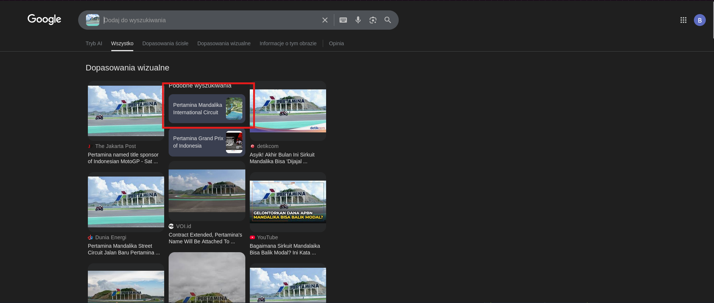

And with that I was able to pinpoint location of this racetrack, which is located in Indonesia!

**Question 1: What is the commercial name of this circuit?**
**Answer: Pertamina Mandalika International Street Circut**

**Question 2: When did the event take place?**
I know from the room description that this friend was on holiday in 2025, so I needed to find out when this motogp event took place in this year. With the help of google search, I have landed on motogp.com website where the exact date was present.

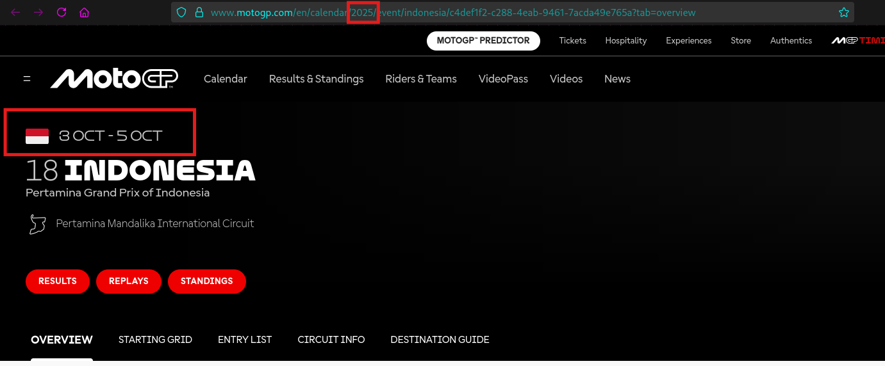

**Answer: 03-05/10/2025**

**Question 3: He told me he ate delicious Mexican food. What is the name of the restaurant?**
Ok, now i need to find a restaurant, probably from the second picture. So I have tried the same trick like before, google reverse image search and I've found the name of the restaurant.

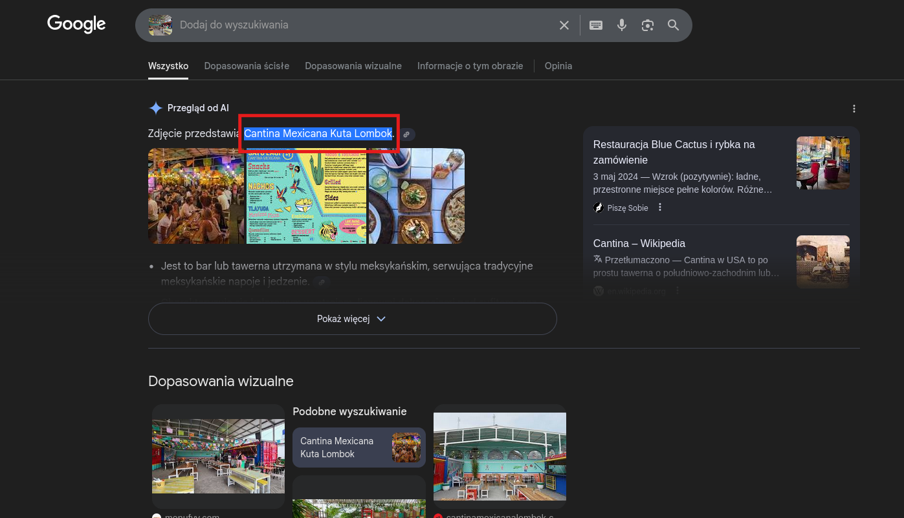

**Answer: Cantina Mexicana**

**Question 4: At what time was this photo taken?**
To find answer for this question, I've used a tool called exiftool, which can extract detailed information (as you can see in the image below) about provided image file. To use it i simply typed in the terminal *exiftool food.jpg*.

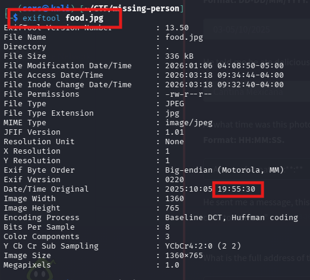

**Answer: 19:55:30**

Before I go to the next question, there is a more information provided about this missing person:
*He sent me a message, this is the last I heard from him: ”Went to this cool MotoGP after party, and became friends with one of the local DJs who played that night. We’re going to visit a cave tomorrow.”*
From what I've read, I think that I'm going to a virtual tour with good ol' google maps. 

**Question 5: What is the full address of the bar's location?**
I've searched for any information about moto gp 2025 Indonesia afterparty on the web and I've found a post on the Instagram about a party in the "Surfersbar". I've searched for the address and I've got a hit.

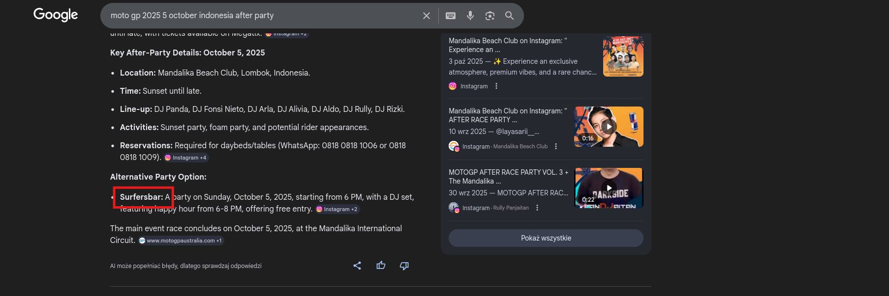

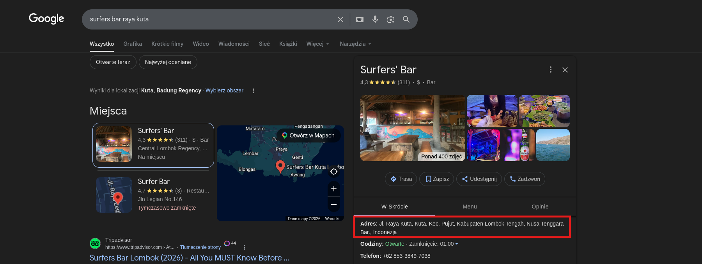

**Answer: Jl. Raya Kuta, Kuta, Kec. Pujut, Kabupaten Lombok Tengah, Nusa Tenggara Bar**

**Question 6: What is the DJ's stage name?**
Now, I need to look for some information about DJ that played there on 5th October 2025. I've found Instagram reel, where DJ's name was present.

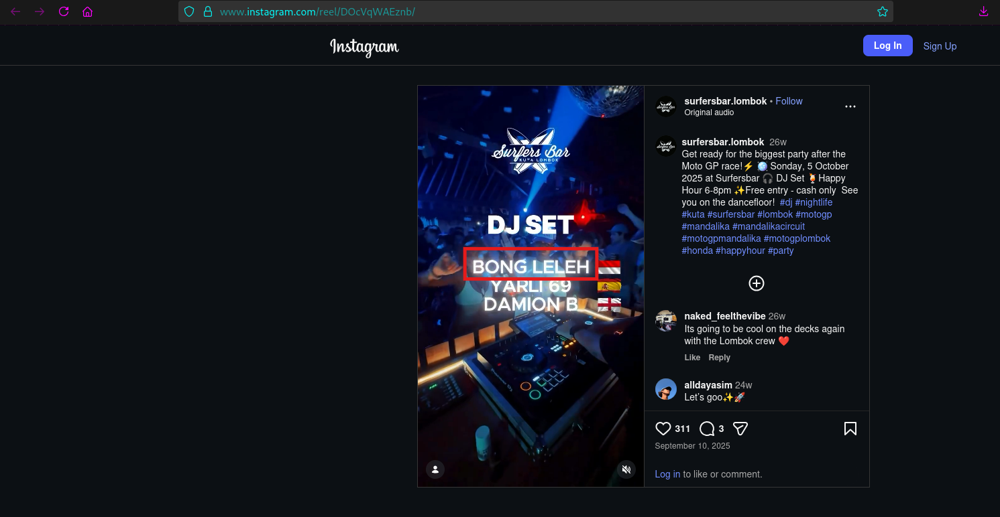

**Answer: Bong Leleh**

**Question 7: After digging into the DJ's other online accounts, what cave does he take tourists to?**
I've found Dj's Instagram account, but I haven't found anything about caves. So I've changed methodology here, instead of looking for his other accounts, I simply used google maps and searched area nearby the Surfersbar for any caves. And the first one that appear from the search was the correct one.

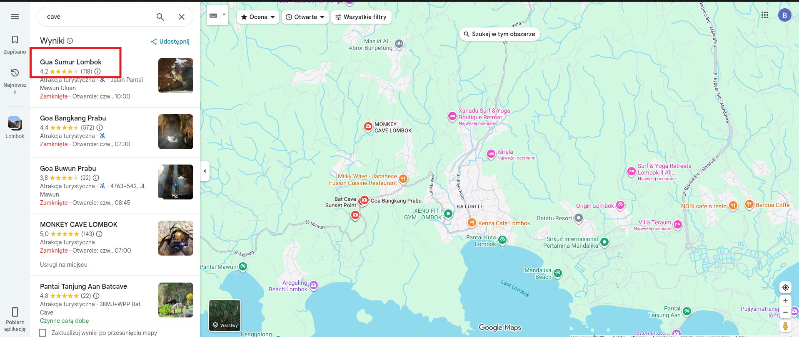

**Answer: Gua Sumur**

**Question 8: What number did the DJ list for his tour business?**
After typing in google search *gua sumur bongleleh*, I've found a facebook page, where the phone number was.

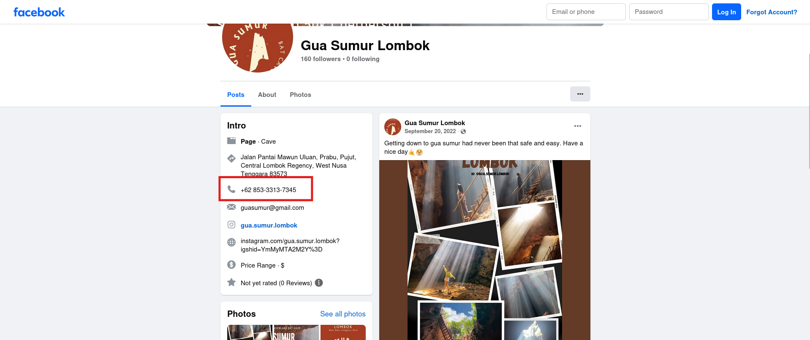

**Answer: 85333137345**

That's it for today. It was really cool room with real life events and people included. I've enjoyed it!