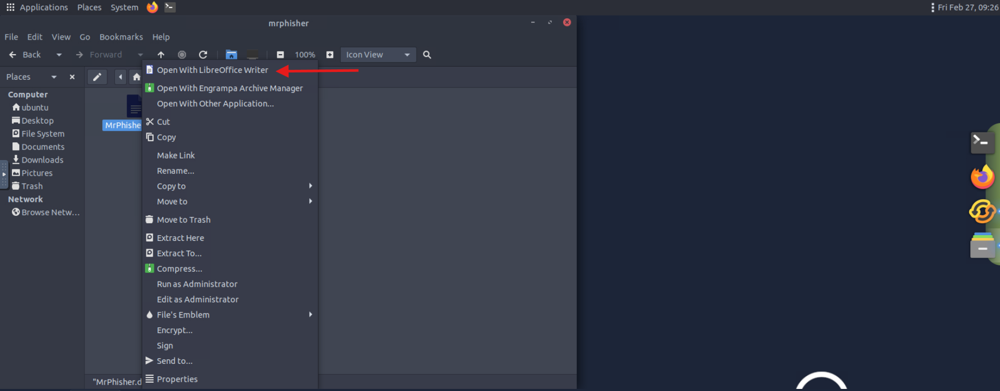
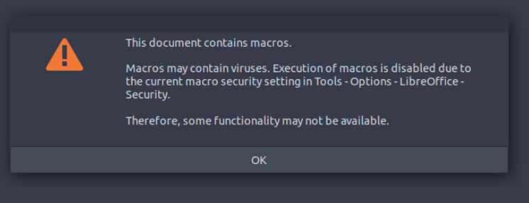
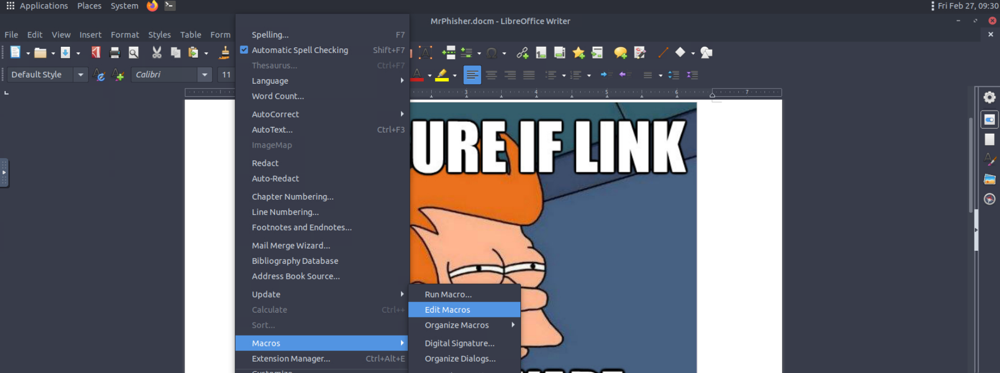
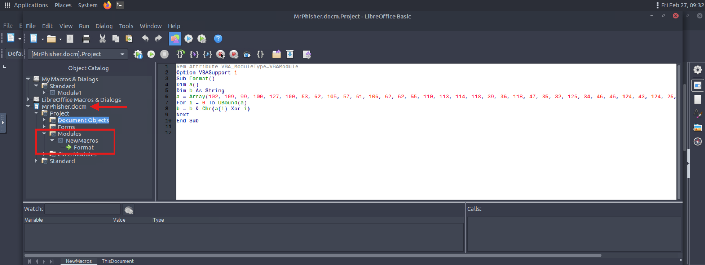
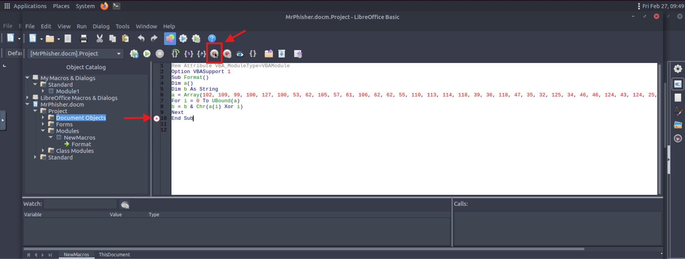
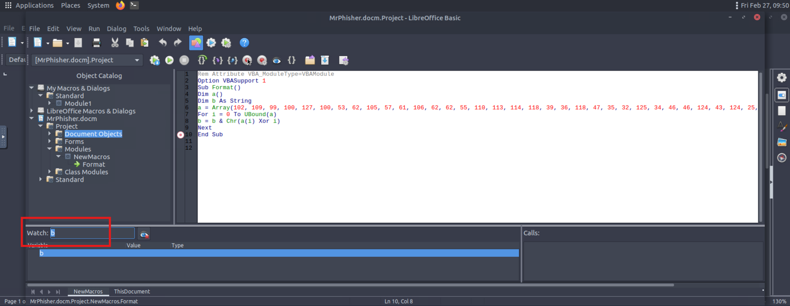
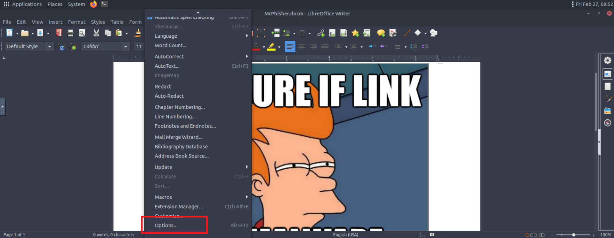
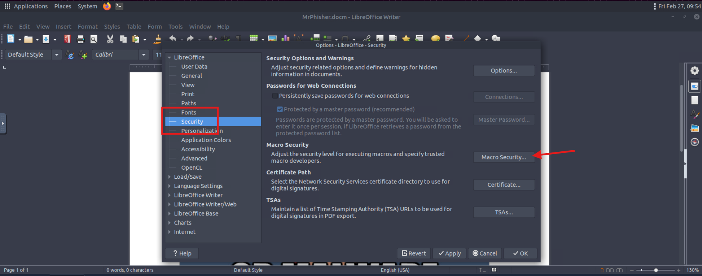
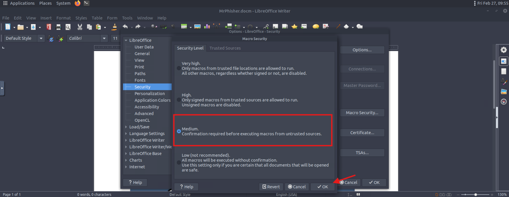
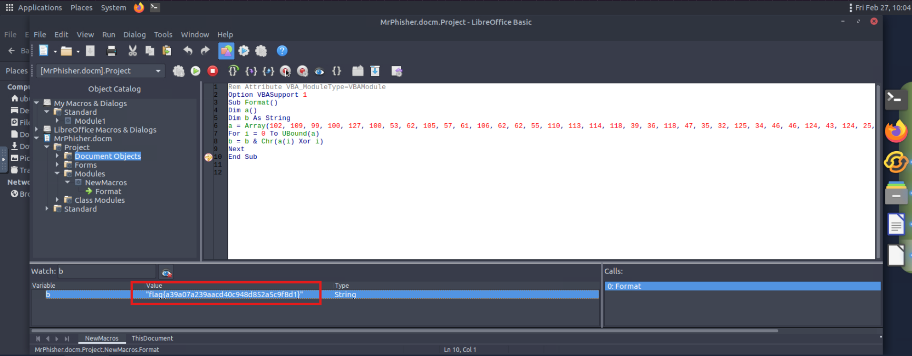

This is a walkthrough for CTF room called Mr. Phisher on tryhackme.com. Enjoy!

Room description:
*I received a suspicious email with a very weird-looking attachment. It keeps on asking me to "enable macros". What are those?*

*... The files you need are located in **/home/ubuntu/mrphisher** on the VM.*

First open *MrPhisher.docm* file with LibreOffice.

Click OK on the alert:

Next navigate to *Tools* -> *Macros* -> *Edit Macros*

Next Navigate into *Mr.Phisher.docm* then to *Modules* -> *NewMacros* -> *Format*

Now we want to run this macro. To do so, we need to enable macros in LibreOffice. First go into *Tools* -> *Options* -> *Security* -> *Macro Security* and there i've changed the setting to *Medium*.
I needed to restart LibreOffice, because other wise i couldn't run macro that i've found earlier.

After doing so, i went back to the macro.
I've added a breakpoint at line 10.

And added variable *b* to grab it's value after executing macro.

And there is the flag:

**Answer: flag{a39a07a239aacd40c948d852a5c9f8d1}**
