Hello. You found a place where you can find answers for tryhackme CTF named PS Eclipse (If you're stuck of course). Let's begin!

**Scenario**: You are a SOC Analyst for an MSSP (MAnaged Security Service Provider) company called **TryNotHackMe**.

A customer sent an email asking for an analyst to investigate the events that occurred on Keegan's machine on **Monday, May 16th, 2022**. The client noted that **the machine** is operational, but some files have a weird file extension. The client is worried that there was a ransomware attempt on Keegan's device.

Your manager has tasked you to check the events in Splunk to determine what occurred in Keegan's device.

Happy Hunting!

Let's jump into Splunk instance.
First click on "Search & Reporting".

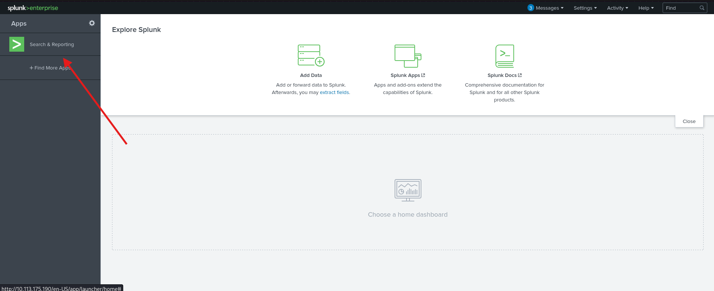

We know when an event occurred it'll help us pinpoint time frame in the logs.

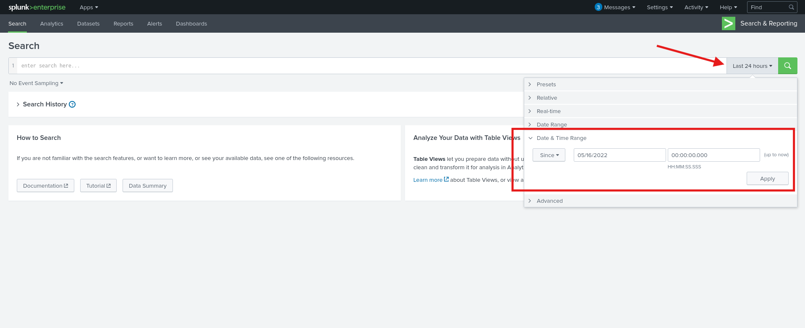

Now we're seeing events that happened since **May 16th 2022**.

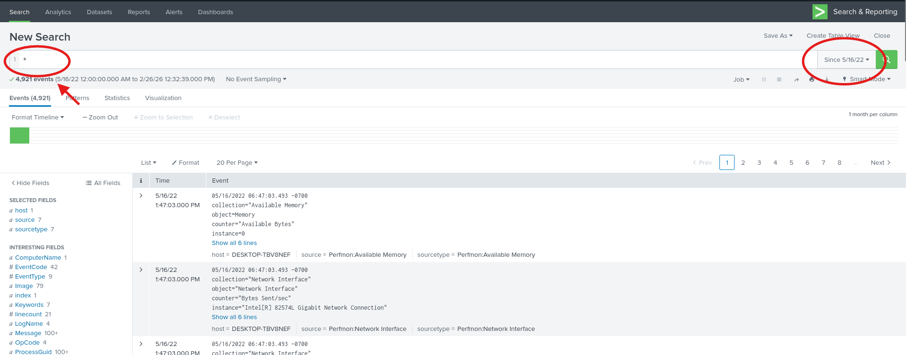

Remember about *wildcard* in the search bar.
Now we can focus on answering the questions.

**Question 1: A suspicious binary was downloaded to the endpoint. What was the name of the binary?**

Having a knowledge that in Sysmon Event ID of process creation is 11, i could apply *EventCode=11* to the search query.
Also from the room description I knew whose machine was infected. I found probable user and apply it as well. One more thing worth noting is that attackers like to abuse powershell/ With this in mind i wrote search query: **\* EventCode=11 User="DESKTOP-TBV8NEF\\\keegan" Image=\*powershell.exe**. I've received nine events back and in one of them i've found a binary file name.

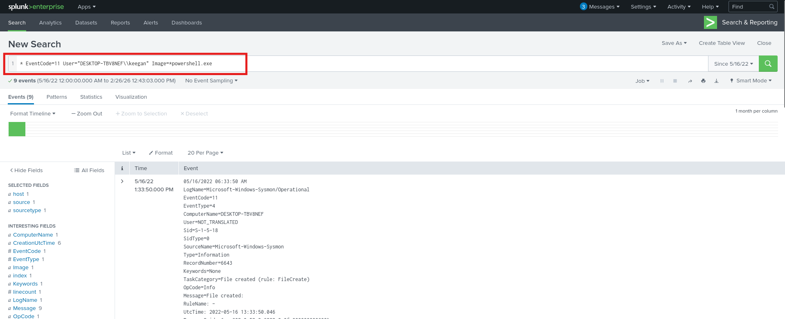

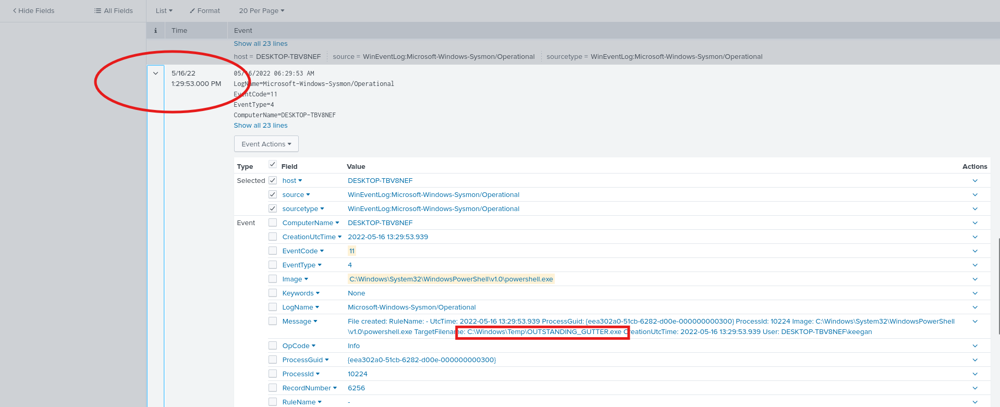

**Answer: OUTSTANDING_GUTTER.exe**

**Question 2: What is the address the binary was downloaded from? Add http:// to your answer & defang the URL**

Here i've added new fields that can be helpful *CommandLine*.
And i've found encoded in base64 command that was executied on the machine. I used CyberChef for decoding and there was URL used to download malicious binary.

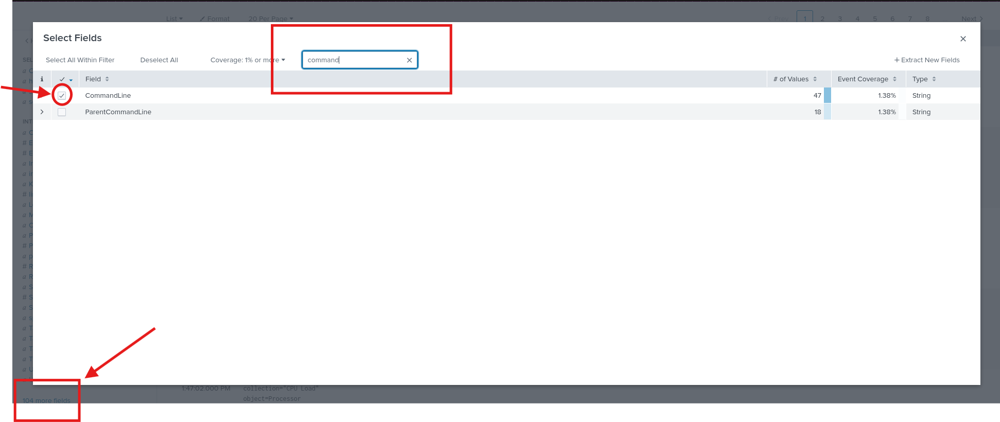

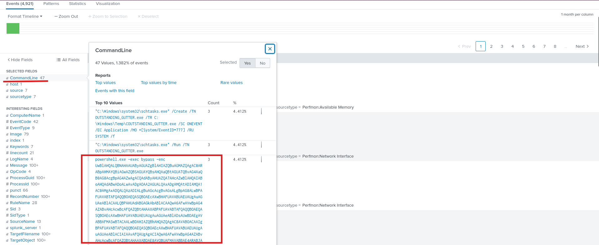

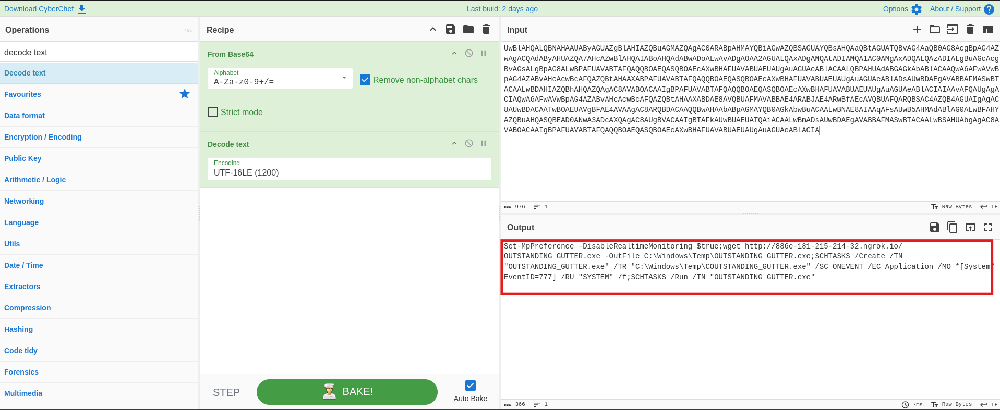

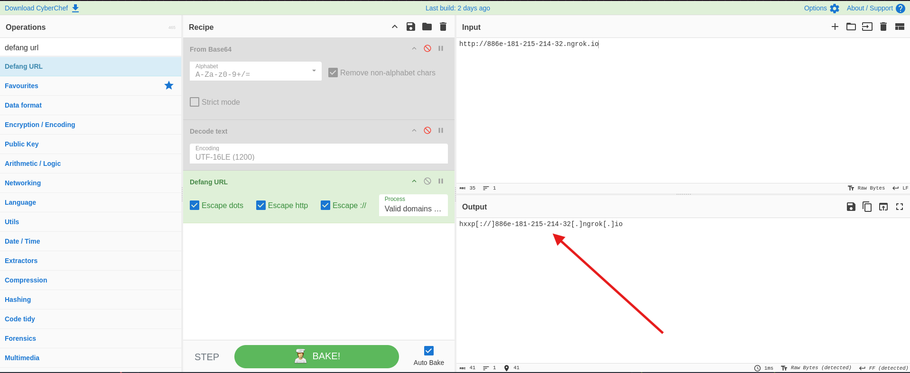

**Answer: hxxp\[://]886e-181-215-214-32\[.]ngrok\[.]io**

**Question 3: What Windows executable was used to download the suspicious binary? Enter full path.**

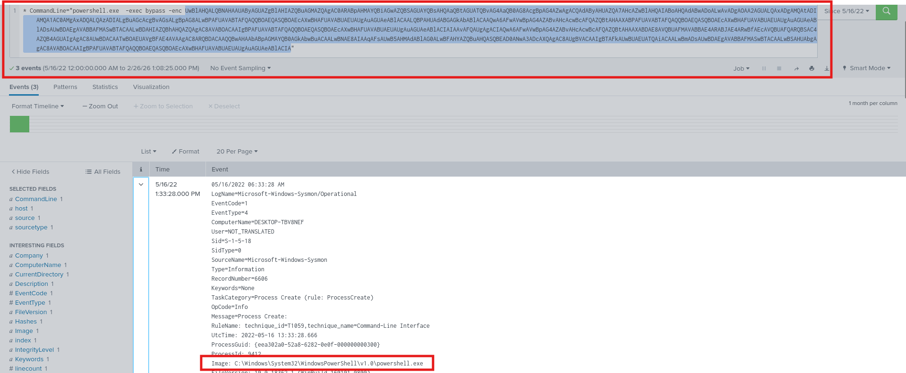

**Answer: C:\Windows\System32\WindowsPowerShell\v1.0\powershell.exe**

**Question 4: What command was executed to configure the suspicious binary to run with elevated privileges?**

I've searched for malicious binary we've found earlier: *\*OUTSTANDING_GUTTER.exe** and looked into *CommandLine* field for what commands has been executed. 

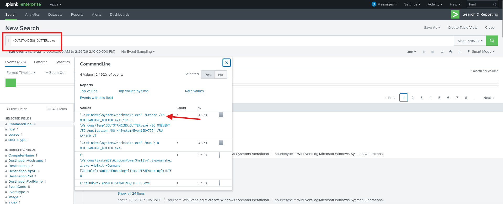

**Answer: "C:\Windows\system32\schtasks.exe" /Create /TN OUTSTANDING_GUTTER.exe /TR C:\Windows\Temp\COUTSTANDING_GUTTER.exe /SC ONEVENT /EC Application /MO *\[System/EventID=777] /RU SYSTEM /f**

**Question 5: What permissions will the suspicious binary run as? What was the command to run the binary with elevated privileges? (Format: *User*+*;*+*CommandLine*)**

Suspicious binary was executed with *schtasks.exe*. Let's search for it and we can see the command it was ran.

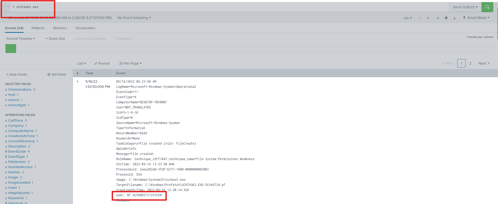

**Answer: NT AUTHORITY\SYSTEM;"C:\Windows\system32\schtasks.exe" /Run /TN OUTSTANDING_GUTTER.exe**

**Question 6: The suspicious binary connected to a remote server. What address did it connect to? What was the name of the file?**

I've putted suspicious binary name *\*OUTSTANDING_GUTTER.exe* into query and checked *QueryName* field to know to which domain suspicious binary connected.

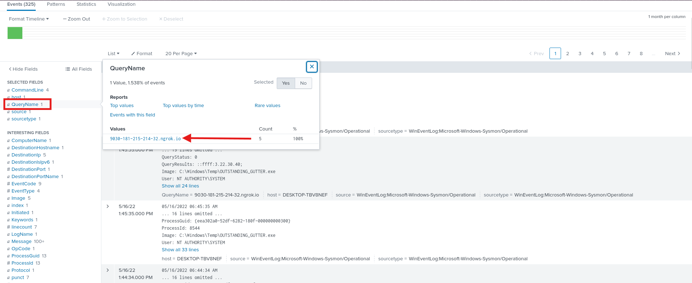

**Answer: hxxp\[://]9030-181-215-214-32\[.]ngrok\[.]io**

**Question 7: A PowerShell script was download to the same location as the suspicious binary. What was the name of the file?**

Search for a powershell extension - *.ps1*.

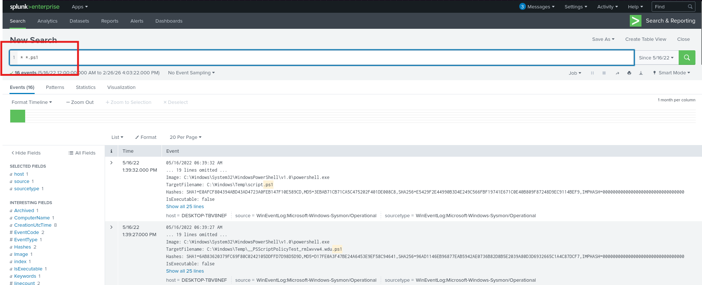

**Answer: script.ps1**

**Question 8: The malicious script was flagged as malicious. What do you think was the actual name of the file?**

Check hash SHA256 of a executed script.ps1 on virustotatl.com and you can see that originally file name was *BlackSun.ps1*.

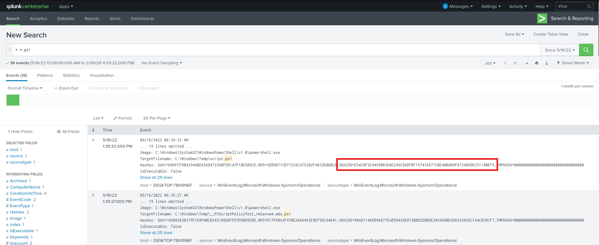

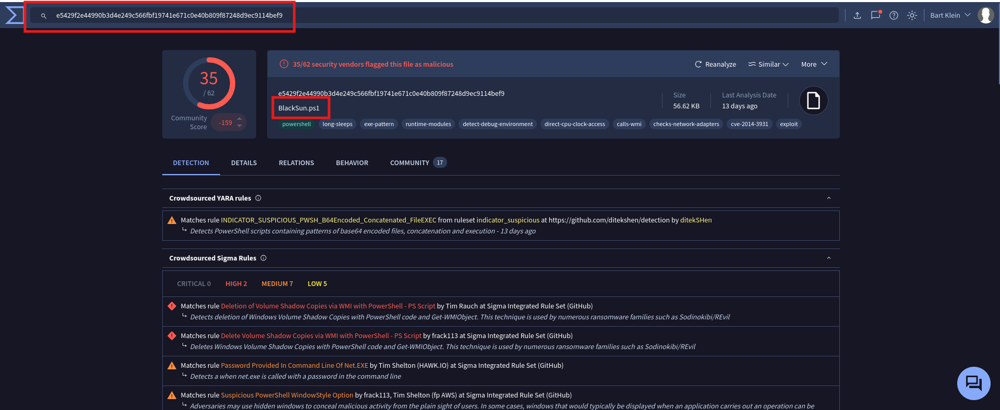

**Answer: BlackSun.ps1**

**Question 9: A ransomware note was saved on disk, which can serve as an IOC. What is the full path to which the ransom note was saved?**

Search for *\*txt* the note should be in this format.

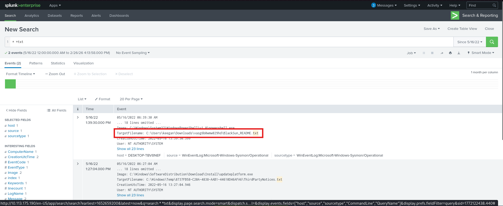

**Answer: C:\Users\keegan\Downloads\vasg6b0wmw029hd\BlackSun_README.txt**

**Question 10: The script saved an image file to disk to replace the user's desktop wallpaper, which can also serve as an IOC. What is the full path of the image?**

I searched for common image file extension by using *\*.jpeg OR .jpg OR .png* and saw suspicious file name that was and answer.

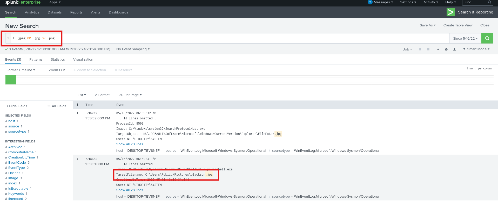

**Answer: C:\Users\Public\Pictures\blacksun.jpg**

That's all.