Hi! Welcome in a write-up of *Plant Photographer* CTF on TryHackMe. If you're stuck by yourself and need help, you have found a great place!

Room description:

*Your friend, a passionate botanist and aspiring photographer, recently launched a personal portfolio website to showcase his growing collection of rare plant photos:*

> `http://MACHINE_IP/`

*Proud of building the site himself from scratch, he’s asked you to take a quick look and let him know if anything could be improved. Look closely at how the site works under the hood, and determine whether it was coded with best practices in mind. If you find anything questionable, dig deeper and try to uncover the flag hidden behind the scenes.*

So, first let's take a look at the website:

First what catches the eye is the download function, where I can download a CV. So, I downloaded it and checked the request in BurpSuite:

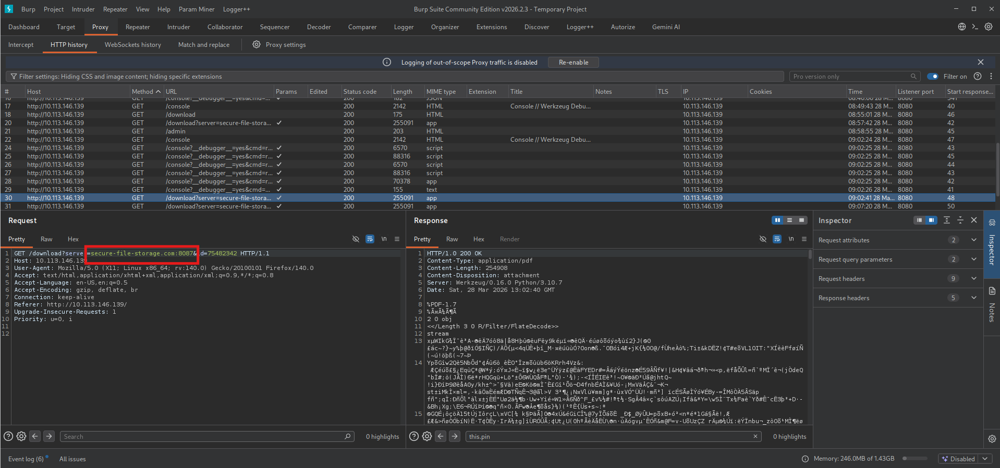

There is a *server* query parameter which I'm gonna use it to send a requests to my own server - it's classic SSRF vulnerability.

I've set up nc listener:

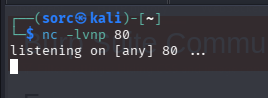

And I've sent a request to myself:

And on the listener I got first flag in the response:

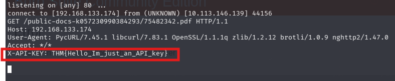

**Question 1: What API key is used to retrieve files from the secure storage service?**

**Answer: THM{Hello_Im_just_an_API_key}**

Next I need to access a admin section on the website. Navigating to the */admin* I was welcomed with a message: *Admin interface only available from localhost!!!*. I need to find a way to go around it.

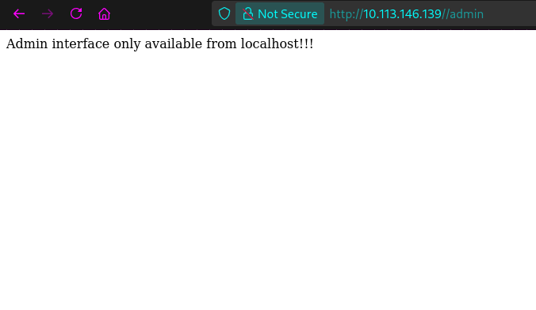

First, I've tried HTTP headers like *X-Forwarded-For: 127.0.0.1*, *X-Custom-IP-Authorization: 127.0.0.1*, *X-Host: 127.0.0.1*, etc, but none of them worked.
Also, I tried to leverage SSRF to access *admin* panel using *localhost/admin*, *127.0.0.1/admin*, and i couldn't make it work.
In the meantime I have ran ffuf and I found */console* which requires PIN to unlock.  Important to note is that PIN is out of bruteforce attacks, because it's gets locked after 10 mistakes. There must be a way around it. 

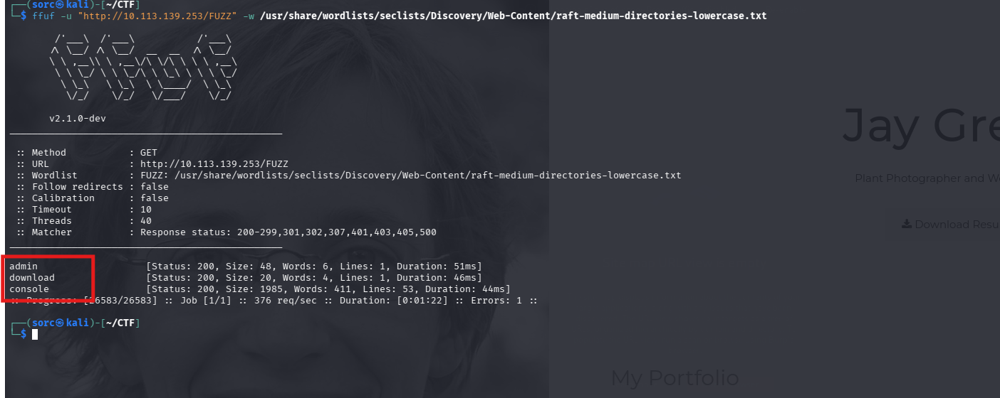

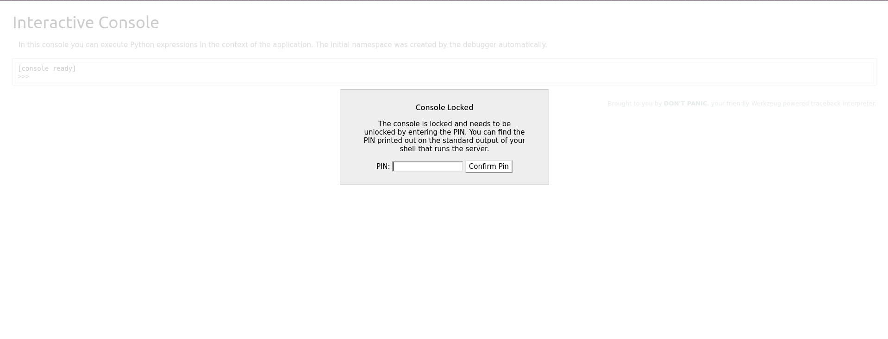

So, few things to check out, but first I'm gonna work with /admin panel, because it is what next question talks about.

I went back to SSRF I've found. And I started playing around with it, because from all the requests I intercepted in Burp it has the higher probability for unlocking */admin* page.
So, the request looks like this:

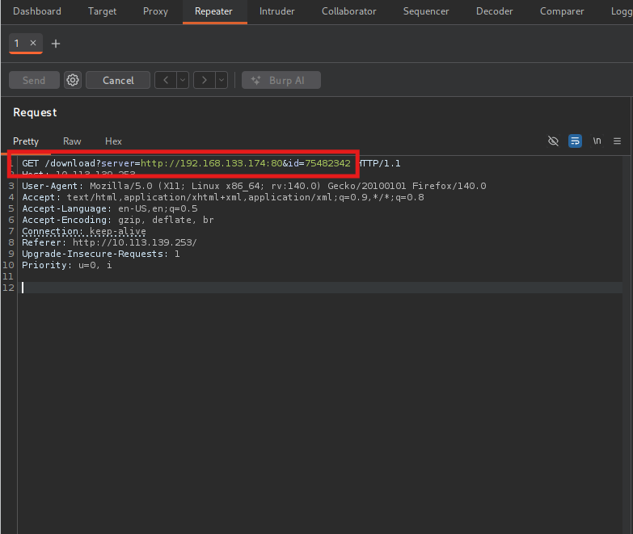

After some testing, I've noticed that *id* parameter must be an integer, and with every response sent back to me there is hard-coded path:

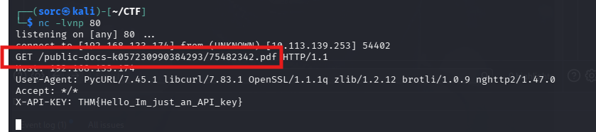

To block this I've used an *anchor* which is *# - hashtag* symbol, which tells to ignore what after him, so the *id* value isn't send to server. Important to note that *#* needs to be URL encoded.

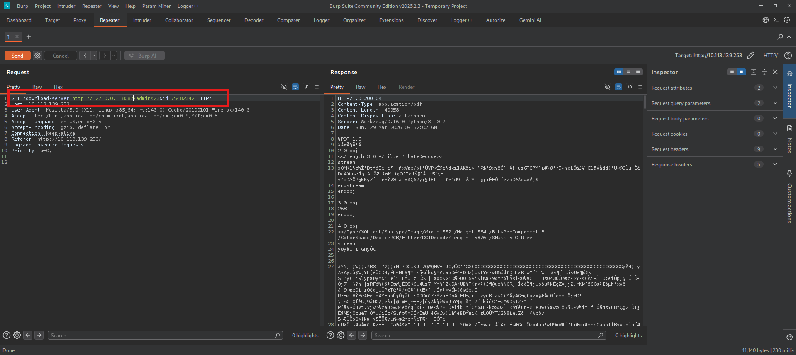

Then I copied the URL of this request and opened it in the browser and I downloaded a pdf file, but this time is not CV, but pdf with the second flag in it:

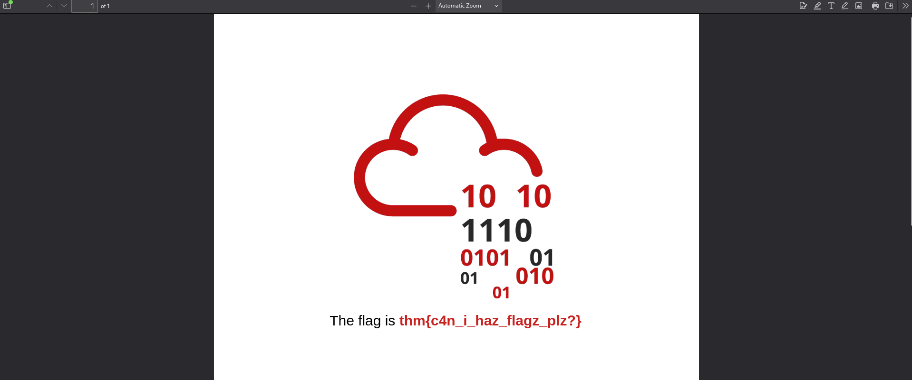

**Question 2: What is the flag in the admin section of the website?**

**Answer: thm{c4n_i_haz_flagz_plz?}**

Now, let's focus on the last question, which is:

**Question 3: What flag is stored in a text file in the server's web directory?**

Last thing to find out is the PIN on the */console* tab. At this point I've started to research server vulnerabilities which is *Werkzeug/0.16.0 Python/3.10.7*, and I've found something interesting. There is known vulnerability that affects the console, and there is a way to reverse engineer PIN. There is an article I've found: https://www.daehee.com/blog/werkzeug-console-pin-exploit/

So, I will go step by step what I needed to do to exploit it.
First thing there is a ability to read server files in the same request that I exploited SSRF to grab other flags. Simply I need to change server query to for example *file:///etc/passwd* as you can see bellow:

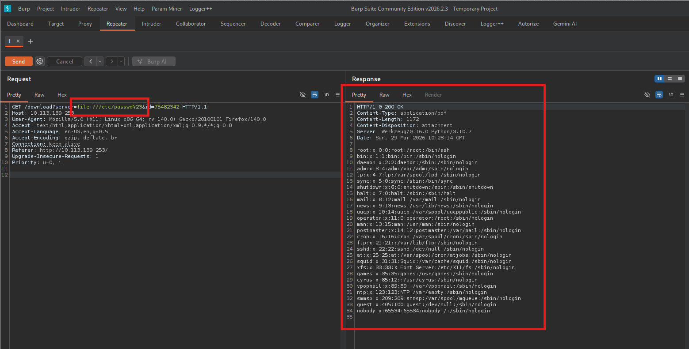

With this I can read system files. First file I need to find is *__init__.py*. But i need to find path to it. I've induced an error to find file path:

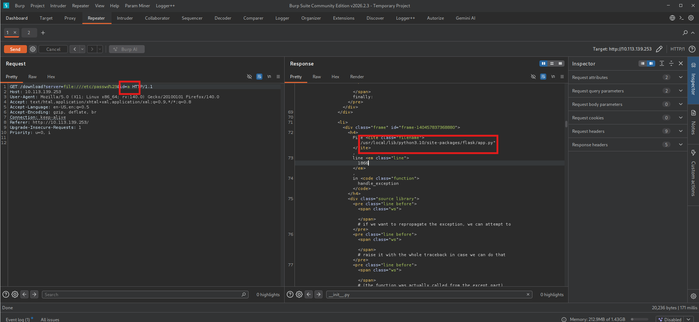

From the article I know that it should be in the */pythonX.X/site-packages/wekzeug/debug/__init.py__*. After pinpointing a python version I crafted a payload and found the source code of the __init.py__ file.

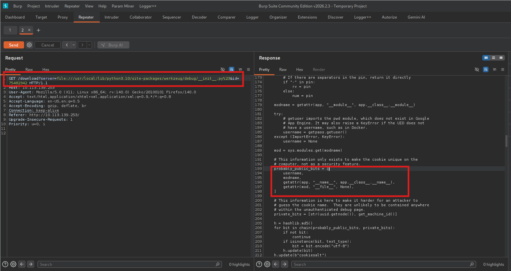

There are variables that I need to find to reverse engineer tha PIN. Those variables are:
 username, modname, getattr(app, "__name__", app.__class__.__name__, getattr(mod, "__file__", None), str(uuid.getnode()), get_machine_id().
I'm not gonna go into details in finding it, there is whole proces described in the article I linked.

First MAC address in hexadecimal format:

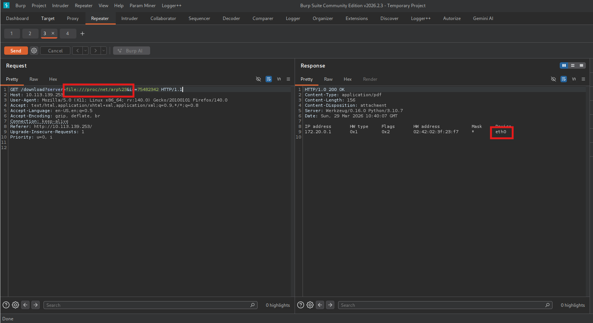

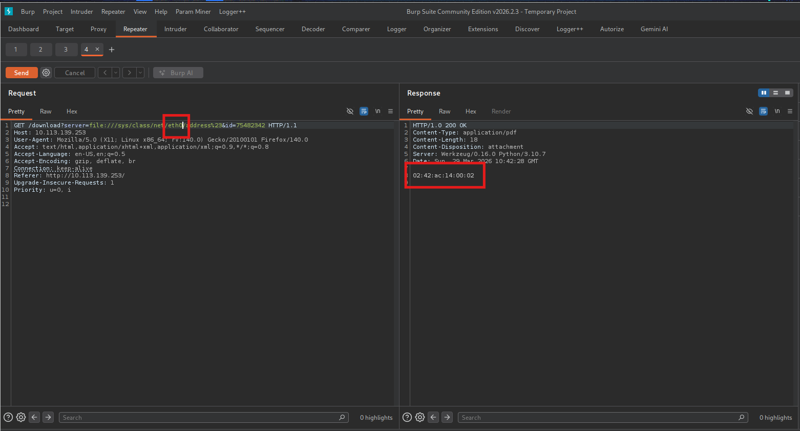

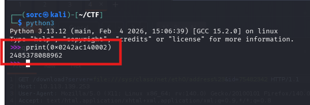

Next - machine id, it is under */proc/self/cgroup*.

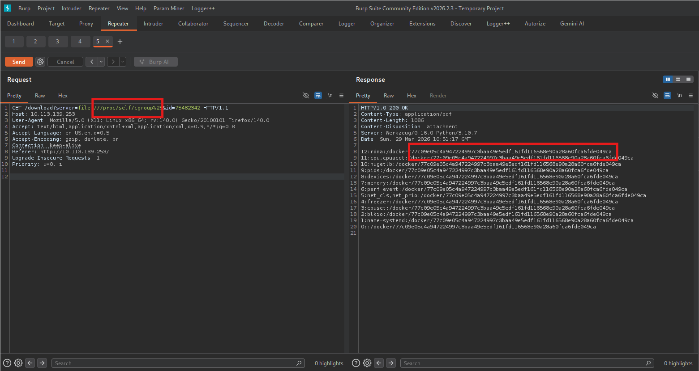

To figure out user I've tried to read a file that only root can read - */etc/shadow* and it works, so I'm root. Also You can find this information in the */proc/self/environ*

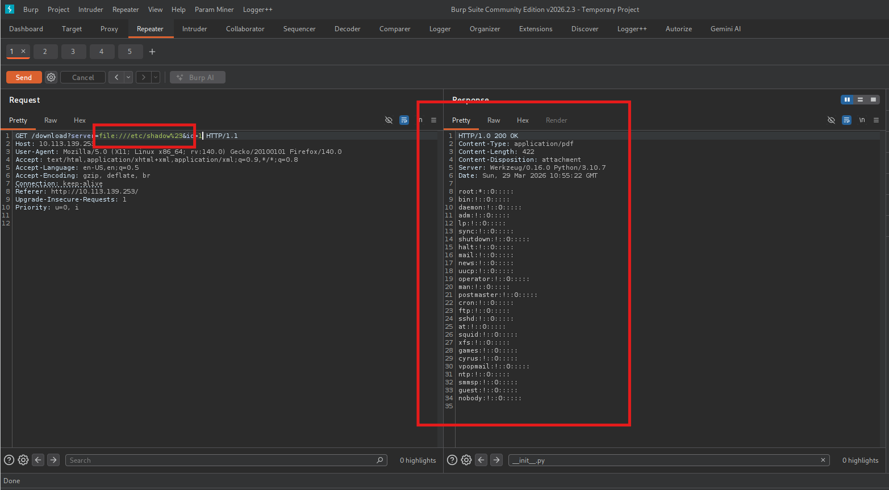

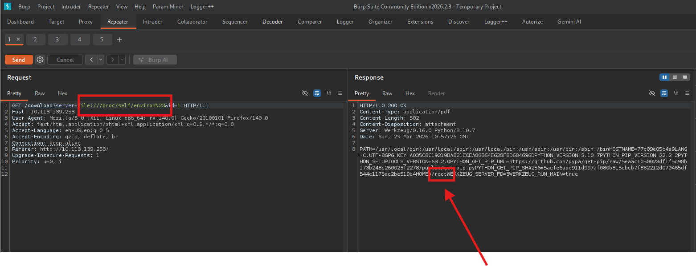

When I gathered all variables needed for the script to run, I put them into it:

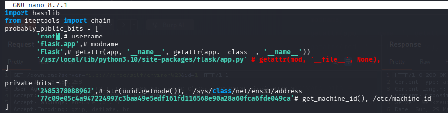

Then I ran it:

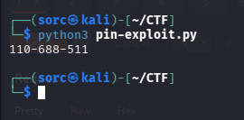

And I got a PIN, console unlocked!

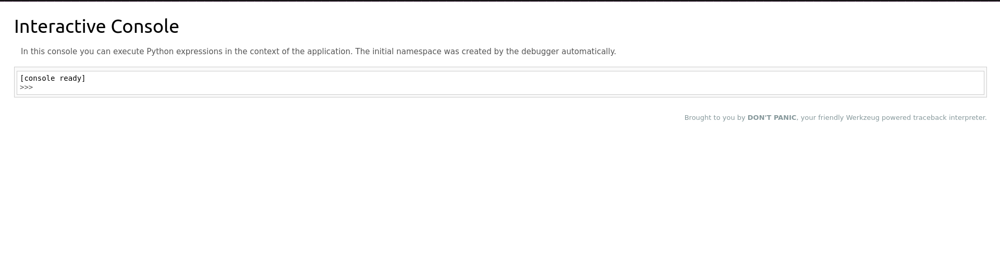

On the console page I've used *\__import__('os').popen('whoami').read();* to execute system commands on the machine:

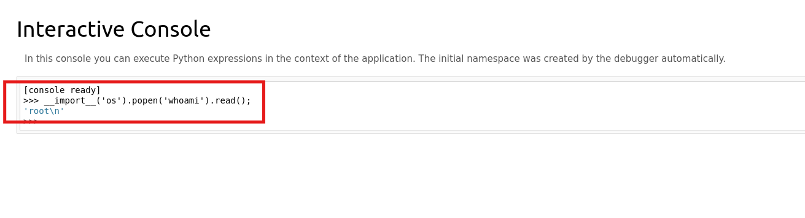

With quick enumeration I found a file in the directory I've landed:

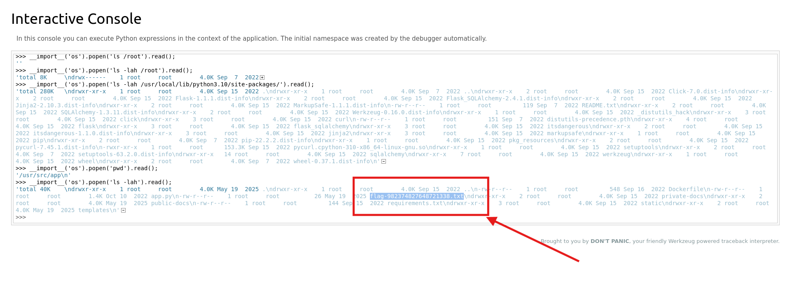

And inside was third and last flag!

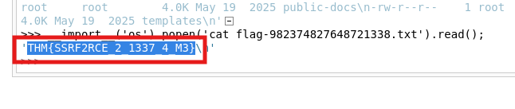

**Answer: THM{SSRF2RCE_2_1337_4_M3}**

